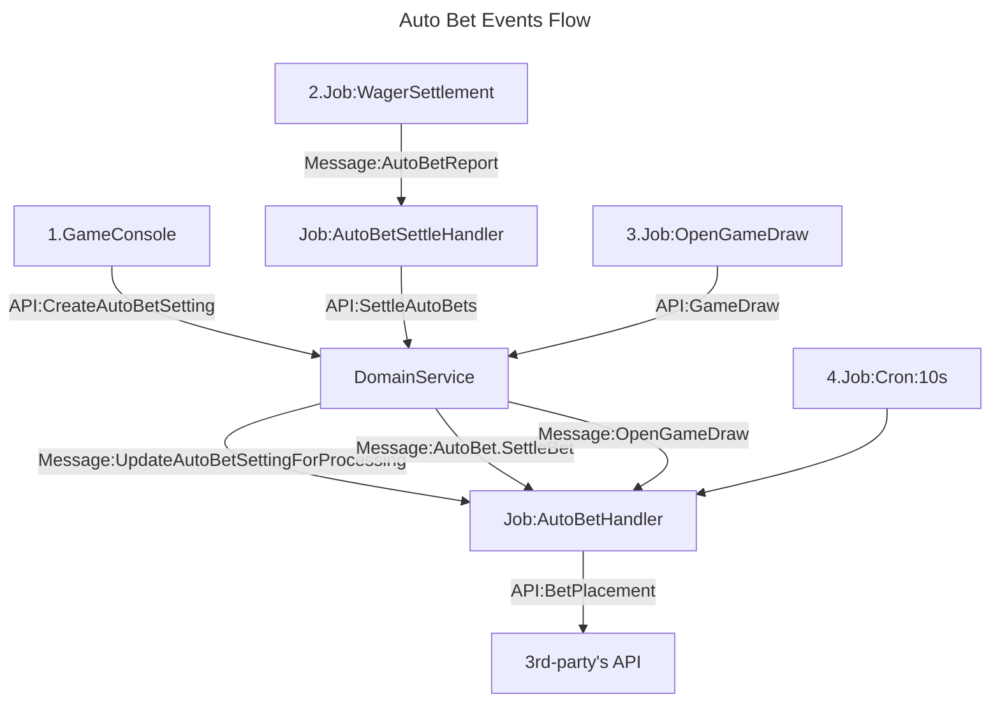

```mermaid
---
title: Auto Bet Events Flow
---
graph TD; 
D[1.GameConsole] -->|API:CreateAutoBetSetting| A[DomainService]; 
A[DomainService] --> |Message:UpdateAutoBetSettingForProcessing| B[Job:AutoBetHandler];
C[2.Job:WagerSettlement] -->|Message:AutoBetReport| E[Job:AutoBetSettleHandler]; 
E[Job:AutoBetSettleHandler] --> |API:SettleAutoBets| A[DomainService];
A[DomainService] --> |Message:AutoBet.SettleBet| B[Job:AutoBetHandler];
F[3.Job:OpenGameDraw] --> |API:GameDraw| A[DomainService];
A[DomainService] --> |Message:OpenGameDraw| B[Job:AutoBetHandler];
G[4.Job:Cron:10s] --> B[Job:AutoBetHandler];
B[Job:AutoBetHandler] --> |API:BetPlacement| H[3rd-party's API]
```
