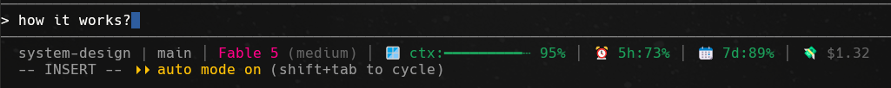

# Claude Code Custom Status Line — Setup Guide

A guide to reproduce a rich, single-line status bar on any computer running Claude Code.

Runnable artifacts in this directory:

- **[`statusline.cjs`](./statusline.cjs)** — the status-line script (zero dependencies, Windows/macOS/Linux).
- **[`settings.windows.example.json`](./settings.windows.example.json)** — the minimal `statusLine` setting for Windows.
- **[`settings.macos-linux.example.json`](./settings.macos-linux.example.json)** — the same setting for macOS/Linux (`$HOME` path).

## Quick start

Two files into your Claude Code config dir (`~/.claude`, or `$CLAUDE_CONFIG_DIR`), then restart.

1. Copy [`statusline.cjs`](./statusline.cjs) into the config dir.
2. Merge the `statusLine` key from the example for your OS
   ([Windows](./settings.windows.example.json) / [macOS/Linux](./settings.macos-linux.example.json))
   into `<config-dir>/settings.json`, fixing the path to point at the script.
3. Restart Claude Code.

Requires Node.js on PATH. See the sections below for verification, gotchas, and customizing.

## What it does

Shows a one-line status bar at the bottom of every Claude Code session:



```
my-project | feat/my-branch │ Fable 5 (medium) │ 🪟 ctx:━━━━━━┄┄┄┄ 63% │ ⏰ 5h:88% │ 📆 7d:15% │ 💸 $1.23
```

Segments, separated by a dim `│`:

| Segment | Source | Style | Hidden when |
|---------|--------|-------|-------------|
| `my-project` | Basename of the current working directory | plain | never |
| `feat/my-branch` | Current git branch (`git rev-parse --abbrev-ref HEAD`) | plain | not a git repo |
| `Fable 5` | Model display name | colored by model | not provided |
| `(medium)` | Reasoning effort level (`effort.level`) | dim, after model | not provided |
| `🪟 ctx:━━━━━━┄┄┄┄ 63%` | Context window **remaining** % with a 10-char bar | colored by remaining | not provided |
| `⏰ 5h:88%` | 5-hour rate limit **remaining** % | colored by remaining | not provided |
| `📆 7d:15%` | 7-day rate limit **remaining** % | colored by remaining | not provided |
| `💸 $1.23` | Session cost in USD | dim | zero / not provided |

Color thresholds (applied to remaining %): **green ≥ 50**, **yellow 21–49**, **red ≤ 20**.

## How it works

Claude Code supports a `statusLine` setting of type `command`. On every refresh it
runs your command, pipes session data as JSON into stdin, and displays whatever
the command prints to stdout (ANSI colors supported). This setup uses a small
Node script ([`statusline.cjs`](./statusline.cjs)) as that command.

## Requirements

- **Claude Code** installed
- **Node.js** on PATH (`node --version` to check)
- **git** on PATH (optional — branch is simply omitted without it)
- A terminal/font that renders **emoji** (🪟 ⏰ 📆 💸; swap the `ICON_*` constants for plain text or Nerd Font glyphs otherwise — see Customizing)

No other dependencies (no `jq`, no bash, works on Windows/macOS/Linux).

## Setup (2 files)

> The config directory is wherever your Claude Code reads settings from —
> normally `~/.claude`, or a custom dir if you set `CLAUDE_CONFIG_DIR`. Put both
> files there and keep the paths consistent.

### 1. Copy the script: `<config-dir>/statusline.cjs`

Copy [`statusline.cjs`](./statusline.cjs) from this directory into your config dir.
The full source is also reproduced at the end of this guide for reference.

**Windows (PowerShell):**

```powershell
Copy-Item .\statusline.cjs "$env:USERPROFILE\.claude\statusline.cjs"
```

**macOS/Linux:**

```bash
cp ./statusline.cjs ~/.claude/statusline.cjs
```

### 2. Add the setting: `<config-dir>/settings.json`

Add a `statusLine` key (see the example file for your OS:
[`settings.windows.example.json`](./settings.windows.example.json) or
[`settings.macos-linux.example.json`](./settings.macos-linux.example.json)).
Create the file with just this object if it doesn't exist; otherwise merge the
key into the existing JSON. Point the path at the script for the target machine.

**Windows** (forward slashes work in JSON too — no need to escape backslashes):

```json
{
  "statusLine": {
    "type": "command",
    "command": "node \"C:/Users/<you>/.claude/statusline.cjs\""
  }
}
```

**macOS/Linux** (`$HOME` expands, or use the absolute path e.g. `/Users/<you>/.claude/statusline.cjs`):

```json
{
  "statusLine": {
    "type": "command",
    "command": "node \"$HOME/.claude/statusline.cjs\""
  }
}
```

### 3. Restart Claude Code

The status line appears at the bottom of the session on next launch.

## Verify it works (optional)

Feed the script a sample payload and check the output.

**Windows (cmd-style redirection avoids a PowerShell BOM issue):**

```powershell
[System.IO.File]::WriteAllText("$env:TEMP\sl-test.json", '{"workspace":{"current_dir":"D:/some/project"},"model":{"display_name":"Fable 5"},"effort":{"level":"medium"},"context_window":{"remaining_percentage":63.2},"rate_limits":{"five_hour":{"used_percentage":12},"seven_day":{"used_percentage":85}},"cost":{"total_cost_usd":1.2345}}')
cmd /c "node C:\Users\<you>\.claude\statusline.cjs < %TEMP%\sl-test.json"
```

**macOS/Linux:**

```bash
echo '{"workspace":{"current_dir":"/some/project"},"model":{"display_name":"Fable 5"},"effort":{"level":"medium"},"context_window":{"remaining_percentage":63.2},"rate_limits":{"five_hour":{"used_percentage":12},"seven_day":{"used_percentage":85}},"cost":{"total_cost_usd":1.2345}}' | node ~/.claude/statusline.cjs
```

Expected output (with ANSI colors):

```
project | <branch-if-git-repo> │ Fable 5 (medium) │ 🪟 ctx:━━━━━━┄┄┄┄ 63% │ ⏰ 5h:88% │ 📆 7d:15% │ 💸 $1.23
```

A minimal payload (no rate limits / cost / context) degrades gracefully, e.g.
just `project │ Fable 5`.

## Gotchas learned during setup

- **PowerShell pipes add a BOM** (``) to stdin, which breaks `JSON.parse`.
  The script strips it defensively (`raw.replace(/^/, '')`). Real Claude
  Code invocations send clean JSON, but this makes manual testing work too.
- **Don't guess the home path.** Use the actual profile directory in
  `settings.json`. On **Windows** read it from `echo $env:USERPROFILE` (the
  account name may differ from the display name); on **macOS/Linux** use
  `echo $HOME`.
- **Keep script and setting in the same config dir.** A stale copy of the
  script in another directory will silently win if `settings.json` points at it.
- **Missing fields are fine.** The script degrades gracefully — outside a git
  repo it shows only the directory; without model/context/rate-limit/cost data
  those segments are simply omitted.
- **`rate_limits` / `cost` availability depends on the Claude Code version.**
  If your version doesn't send them in the statusline JSON, those segments
  won't appear. Log `raw` to a temp file once to inspect what your version provides.

## Customizing

Edit `statusline.cjs` and restart Claude Code:

- **Different icons?** Replace the `ICON_*` constants (`ICON_CTX` 🪟, `ICON_CLOCK` ⏰,
  `ICON_CALENDAR` 📆, `ICON_COST` 💸) with other emoji, plain text (e.g. `'$'`),
  or Nerd Font glyphs if your terminal font supports them.
- **Bar width:** change the `width = 10` default in `miniBar`.
- **Color thresholds:** adjust the `<= 20` / `<= 49` cutoffs in `colorByRemain`.
- **Full path instead of folder name:** replace `require('path').basename(cwd)` with `cwd`.
- **Different separator:** change `SEP`.
- More session fields are available in the stdin JSON — see the full reference below.

---

## Full stdin JSON Reference

Claude Code pipes the following JSON to your script on each refresh.
Fields marked **optional** may be absent depending on context or Claude Code version.

### Top-level

| Field | Type | Description |
|-------|------|-------------|
| `cwd` | string | Current working directory |
| `session_id` | string | Unique session identifier |
| `session_name` | string | Custom name (optional — only when set via `--name` or `/rename`) |
| `transcript_path` | string | Path to the conversation transcript `.jsonl` file |
| `version` | string | Claude Code version (e.g. `2.1.90`) |
| `exceeds_200k_tokens` | boolean | Whether total token count from the last response exceeds 200 k |

### `model`

| Field | Type | Description |
|-------|------|-------------|
| `model.id` | string | Model identifier, e.g. `claude-sonnet-4-6` |
| `model.display_name` | string | Human-readable name, e.g. `Sonnet 4.6` |

### `workspace`

| Field | Type | Description |
|-------|------|-------------|
| `workspace.current_dir` | string | Current working directory (prefer over top-level `cwd`) |
| `workspace.project_dir` | string | Directory where the session was launched |
| `workspace.added_dirs` | array | Extra dirs added via `/add-dir`; empty array if none |
| `workspace.git_worktree` | string | **optional** — git worktree name; absent in the main working tree |
| `workspace.repo.host` | string | **optional** — repo host, e.g. `github.com` |
| `workspace.repo.owner` | string | **optional** — repo owner / org |
| `workspace.repo.name` | string | **optional** — repo name |

### `context_window`

| Field | Type | Description |
|-------|------|-------------|
| `context_window.context_window_size` | number | Max context size in tokens (e.g. 200000) |
| `context_window.total_input_tokens` | number | Input tokens currently in context |
| `context_window.total_output_tokens` | number | Output tokens from the most recent response |
| `context_window.used_percentage` | number \| null | % of context used; `null` before first API call or after `/compact` |
| `context_window.remaining_percentage` | number \| null | % of context remaining; same nullability as above |
| `context_window.current_usage` | object \| null | Token breakdown; `null` before first API call or after `/compact` |
| `context_window.current_usage.input_tokens` | number | Fresh input tokens |
| `context_window.current_usage.output_tokens` | number | Generated output tokens |
| `context_window.current_usage.cache_creation_input_tokens` | number | Tokens written to prompt cache |
| `context_window.current_usage.cache_read_input_tokens` | number | Tokens read from prompt cache |

### `cost`

| Field | Type | Description |
|-------|------|-------------|
| `cost.total_cost_usd` | number | Estimated session cost in USD (client-side calculation) |
| `cost.total_duration_ms` | number | Wall-clock time since session start, ms |
| `cost.total_api_duration_ms` | number | Time spent waiting for API responses, ms |
| `cost.total_lines_added` | number | Lines of code added this session |
| `cost.total_lines_removed` | number | Lines of code removed this session |

### `rate_limits` *(Claude.ai Pro/Max subscribers only)*

Absent entirely for API-key users. Each window may also be independently absent.

| Field | Type | Description |
|-------|------|-------------|
| `rate_limits.five_hour.used_percentage` | number | % of 5-hour rolling window consumed (0–100) |
| `rate_limits.five_hour.resets_at` | number | Unix epoch (seconds) when the 5-hour window resets |
| `rate_limits.seven_day.used_percentage` | number | % of 7-day rolling window consumed (0–100) |
| `rate_limits.seven_day.resets_at` | number | Unix epoch (seconds) when the 7-day window resets |

### `effort` *(optional)*

Present only when the active model supports a reasoning-effort parameter.

| Field | Type | Description |
|-------|------|-------------|
| `effort.level` | string | `low` / `medium` / `high` / `xhigh` / `max` |

### `thinking` *(optional)*

| Field | Type | Description |
|-------|------|-------------|
| `thinking.enabled` | boolean | Whether extended thinking is on for this session |

### `output_style` *(optional)*

| Field | Type | Description |
|-------|------|-------------|
| `output_style.name` | string | Name of the current output style (e.g. `default`) |

### `vim` *(optional)*

Present only when vim mode is enabled in settings.

| Field | Type | Description |
|-------|------|-------------|
| `vim.mode` | string | `NORMAL` / `INSERT` / `VISUAL` / `VISUAL LINE` |

### `agent` *(optional)*

Present only when running with `--agent` or agent settings configured.

| Field | Type | Description |
|-------|------|-------------|
| `agent.name` | string | Name of the active agent |

### `pr` *(optional)*

Present only while an open PR exists for the current branch.

| Field | Type | Description |
|-------|------|-------------|
| `pr.number` | number | Pull request number |
| `pr.url` | string | Full PR URL |
| `pr.review_state` | string | **optional** — `approved` / `pending` / `changes_requested` / `draft` |

### `worktree` *(optional)*

Present only during `--worktree` sessions.

| Field | Type | Description |
|-------|------|-------------|
| `worktree.name` | string | Worktree name |
| `worktree.path` | string | Absolute path to the worktree directory |
| `worktree.branch` | string | **optional** — git branch for the worktree |
| `worktree.original_cwd` | string | Directory Claude was in before entering the worktree |
| `worktree.original_branch` | string | **optional** — branch checked out before entering the worktree |

### Environment variables set by Claude Code

Available inside your script process (requires Claude Code v2.1.153+):

| Variable | Description |
|----------|-------------|
| `COLUMNS` | Current terminal width in characters |
| `LINES` | Current terminal height in rows |

### `statusLine` config options (settings.json)

```json
{
  "statusLine": {
    "type": "command",
    "command": "node \"/abs/path/to/statusline.cjs\"",
    "padding": 2,
    "refreshInterval": 5,
    "hideVimModeIndicator": true
  }
}
```

| Key | Type | Description |
|-----|------|-------------|
| `type` | string | Must be `"command"` |
| `command` | string | Shell command or absolute script path |
| `padding` | number | **optional** — extra horizontal padding in chars (default `0`) |
| `refreshInterval` | number | **optional** — re-run every N seconds in addition to event-driven updates (min `1`) |
| `hideVimModeIndicator` | boolean | **optional** — suppress the built-in `-- INSERT --` text when your script renders `vim.mode` |

### Update triggers

Your script is re-run after:
- Each new assistant message
- `/compact` finishes
- Permission mode changes
- Vim mode toggles
- Every `refreshInterval` seconds (if configured)

Updates are debounced at 300 ms.

---

## Appendix — `statusline.cjs` source

See [`statusline.cjs`](./statusline.cjs) in this directory for the full, copy-ready script.
