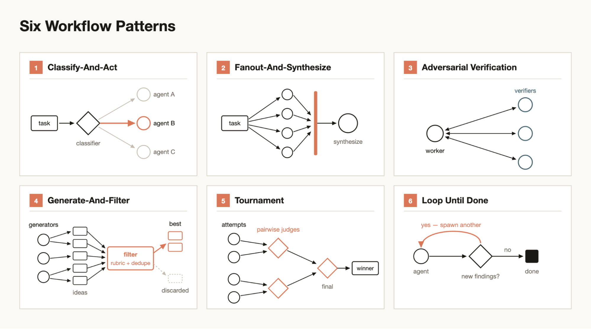

<!-- omit in toc -->
# 用動態工作流（Dynamic Workflows）在 Claude Code 上設計 AI Agent
> **一份實務導向的「動態工作流」入門 —— 這是讓 Claude Code 能即時為手上任務量身打造 harness、在單一 session 內擴散（fan out）數十到數百個 sub-agent、並在交回結果前先驗證自己工作的協調層。**

<!-- omit in toc -->
## 📋 Table of Contents

- [1. 問題所在：單一 context window 對大型任務是糟糕的 harness](#1-問題所在單一-context-window-對大型任務是糟糕的-harness)
- [2. 協調 agent 的三種方式 —— 以及工作流的差異](#2-協調-agent-的三種方式--以及工作流的差異)
- [3. UltraCode = 超高 effort + 動態工作流](#3-ultracode--超高-effort--動態工作流)
- [4. Claude 如何建構工作流：analyze → plan → execute → synthesize](#4-claude-如何建構工作流analyze--plan--execute--synthesize)
- [5. 工作流 script 的解剖](#5-工作流-script-的解剖)
  - [5.1 必備的 `meta` 區塊](#51-必備的-meta-區塊)
  - [5.2 協調用的 hooks](#52-協調用的-hooks)
  - [5.3 環境全域變數](#53-環境全域變數)
  - [5.4 黃金法則：預設用 `pipeline()`，只有真正需要屏障時才用 `parallel()`](#54-黃金法則預設用-pipeline只有真正需要屏障時才用-parallel)
- [6. 六種工作流模式](#6-六種工作流模式)
  - [模式 1 — 擴散與彙整（Fan-out \& synthesize）](#模式-1--擴散與彙整fan-out--synthesize)
  - [模式 2 — 分類與執行（Classify \& act）](#模式-2--分類與執行classify--act)
  - [模式 3 — 對立式驗證（Adversarial verification）](#模式-3--對立式驗證adversarial-verification)
  - [模式 4 — 產生與篩選（Generate \& filter）](#模式-4--產生與篩選generate--filter)
  - [模式 5 — 錦標賽（Tournament）](#模式-5--錦標賽tournament)
  - [模式 6 — 迴圈到完成（Loop until done）](#模式-6--迴圈到完成loop-until-done)
- [7. 完整範例 A —— 通用的程式碼審查擴散](#7-完整範例-a--通用的程式碼審查擴散)
- [8. 完整範例 B —— 帶把關的 SDLC 管線（擴散 ＋ 對立 ＋ 迴圈）](#8-完整範例-b--帶把關的-sdlc-管線擴散--對立--迴圈)
- [9. 結構化輸出：程式碼與模型之間的契約](#9-結構化輸出程式碼與模型之間的契約)
- [10. 成本與控制 —— 跑工作流而不燒掉 2M token](#10-成本與控制--跑工作流而不燒掉-2m-token)
- [11. 設計自己工作流的檢查清單](#11-設計自己工作流的檢查清單)
- [12. 如何執行](#12-如何執行)
  - [一句話總結](#一句話總結)

---

本文說明動態工作流*是什麼*、*為何存在*、script API *如何運作*、**六種可重用模式**，以及一組取自正式工作流的**標註 JavaScript 範例**。對象是在 Claude Code 上構建多 agent 系統的工程師。

資料來源：[*A harness for every task: dynamic workflows in Claude Code*](https://claude.com/blog/a-harness-for-every-task-dynamic-workflows-in-claude-code)、UltraCode 操作講解，以及兩支正式的工作流 script（`dev-pipeline`、`code-review-fanout`）。

> 英文版：[`README.md`](./README.md)

## 1. 問題所在：單一 context window 對大型任務是糟糕的 harness

單一 Claude Code agent 把所有事情都跑在一個 context window 裡。對小型、線性的任務這沒問題；但碰到大型、多環節的工作時，會出現三種可預期的失敗模式：

| 失敗模式 | 實際長相 |
| --- | --- |
| **Agentic 懶惰（laziness）** | Claude 在龐雜任務上提早收手 ——「我把主要的修好了」—— 而不是全部做完。 |
| **自我偏好偏誤（self-preferential bias）** | 要它驗證自己的輸出時，它偏袒自己的答案、把檢查放水通過。 |
| **目標漂移（goal drift）** | 跨越許多回合後，它逐漸偏離原本的目標。 |

根本原因是結構性的：**一個 context、一種視角、一趟通過。** 通用 harness 修不了這點。真正的解法是讓 Claude *為任務寫出專屬的 harness* —— 把工作拆分到許多獨立的 context window、平行執行，並讓驗證者與產出者對立把關。

---

## 2. 協調 agent 的三種方式 —— 以及工作流的差異

| 方式 | 拓撲 | 溝通 | 可重跑？ |
| --- | --- | --- | --- |
| **Sub-agents** | 父 → 子。Orchestrator 開一個子 agent、拿回結果、結束。 | 一次性，僅父↔子。 | 否 —— 每次都是臨時的。 |
| **Agent teams** | Manager → 彼此對話的同儕（builder ↔ QA ↔ reviewer）同時處理同一專案。 | 同儕對等、即時。 | 否。 |
| **Dynamic workflows** | 一支**可執行 script**：擴散 sub-agent、彙整結果、套用 loop／condition／map／filter —— 全部在執行*之前*就寫定。 | 透過 script 的控制流（回傳值，而非閒聊）。 | **是** —— 它是一個檔案，可儲存、參數化、重新調用。 |

視覺上，三者的差異在於**誰來協調**以及**誰跟誰溝通**：

```text
  (1) SUB-AGENTS                 (2) AGENT TEAMS                (3) DYNAMIC WORKFLOWS
      父 → 子                        manager → 同儕                 script → agents
      一次性、隔離                    即時、彼此對話                  決定性控制流

      ┌─────────────┐                ┌─────────────┐                ┌───────────────────────────┐
      │ Orchestrator│                │ Team manager│                │  workflow.js              │
      └──┬───┬───┬──┘                └──────┬──────┘                │  phase()·parallel()       │
   spawn │   │   │                  開出一個 │ 團隊                  │  ·pipeline()·loop·gate    │
    ┌────┘   │   └────┐            ┌─────────┼─────────┐             └──┬─────────┬─────────┬────┘
    ▼        ▼        ▼            ▼         ▼         ▼            spawn│         │         │loop
 ┌─────┐ ┌─────┐ ┌─────┐      ┌──────┐  ┌──────┐  ┌──────┐             ▼         ▼         ▼
 │sub A│ │sub B│ │sub C│      │Builder│◄►│  QA  │◄►│Review│        ┌──────┐  ┌──────┐ ┌────────┐
 └──┬──┘ └──┬──┘ └──┬──┘      └──┬───┘  └──┬───┘  └───┬──┘        │agent │  │agent │ │verifier│
    └───────┼───────┘            └─────────┼─────────┘            └──┬───┘  └──┬───┘ └───┬────┘
            ▼                     共享工作狀態                          └─ return ┴ values ─┘
       回傳結果                 （同儕即時對話、併發進行）                          ▼
                                                                       彙整 → 主 session

  無同儕對話 · 臨時的         即時同儕對等 ·                     agent 之間不對話；由 SCRIPT
  · 不儲存                    並非可重跑的檔案                   路由它們的回傳值 ·
                                                               可儲存 · 可參數化 · 可重跑
```

- **Sub-agents** —— orchestrator 擴散子 agent，每個在隔離中執行、回傳一次。彼此之間沒有協調；下一次什麼都不留存。
- **Agent teams** —— manager 開出一群**即時溝通**的同儕，併發處理同一專案（builder ↔ QA ↔ reviewer），共享工作狀態。強大，但這是一個即時編排，不是可重跑的檔案。
- **Dynamic workflows** —— **script** 才是協調者。Agent 之間從不對話；由 *JavaScript 控制流* 路由它們的回傳值、套用 loop／gate／filter、並彙整 —— 而且因為它是檔案，你可以儲存、參數化、重新調用。

關鍵區別：動態工作流是**圍繞著非決定性 agent 的決定性協調（deterministic orchestration）。** 控制流（什麼擴散、什麼把關、什麼迴圈）寫在純 JavaScript 裡；判斷（讀程式碼、找 bug、寫計畫）留在 sub-agent 裡。你在想要可靠的地方拿到程式碼的可靠性，在想要智慧的地方拿到模型的智慧。

---

## 3. UltraCode = 超高 effort + 動態工作流

`/effort` 設定 Claude Code session 的努力層級：`low · medium · high · ultracode`。**UltraCode** 其實就是：

```
UltraCode  =  超高（extra-high）思考 effort  +  動態工作流（預設開啟）
```

你*不需要* UltraCode 才能跑工作流。在任何 effort 層級的提示中加入關鍵字 **`workflow`**（或 **`ultracode`**）就會讓 Claude Code 撰寫並執行一支。UltraCode 只是把工作流變成預設、並把思考天花板開到最高 —— 這也是它最貴的原因（資料來源中的示範，單次留言分析跑了約 2M token／約 11 分鐘）。

實務準則：當任務**很廣**（多檔案／多角度）或需要**獨立驗證**時，採用工作流；小型線性編輯就維持單 agent。

---

## 4. Claude 如何建構工作流：analyze → plan → execute → synthesize

```
  提示  ─►  ANALYZE          理解意圖與範圍
           │
           ▼
           PLAN              寫一支含 loop／condition／map／filter 的 JS script
           │
           ▼
           EXECUTE           擴散 sub-agent（平行／管線化）、把關、迴圈
           │
           ▼
           SYNTHESIZE        把發現彙整回主 session
```

中間那段是一支真正的 script。以下全部是這支 script 所依據的 API。

---

## 5. 工作流 script 的解剖

工作流是**純 JavaScript**（不是 TypeScript —— 不能用型別標註、interface 或 generics）。它跑在 async context，所以可直接 `await`。`Date.now()`、`Math.random()` 與無參數的 `new Date()` 被**停用**（會破壞可恢復性 resumability —— 改用 `args` 傳入時間戳）。

### 5.1 必備的 `meta` 區塊

每支 script 以一個**純字面值（pure literal）** `meta` 物件開頭 —— 不可有變數、函式呼叫或字串插值：

```js
export const meta = {
  name: 'find-flaky-tests',
  description: 'Find flaky tests and propose fixes',   // 顯示在權限對話框
  phases: [                                            // 每個 phase() 對應一筆
    { title: 'Scan', detail: 'grep CI logs for retry markers' },
    { title: 'Fix',  detail: 'one agent per flaky test' },
  ],
};
// script 本體從這裡開始
```

### 5.2 協調用的 hooks

| Hook | 簽章 | 作用 |
| --- | --- | --- |
| `agent(prompt, opts?)` | `=> Promise<any>` | 擴散一個 sub-agent。回傳它的最終文字字串 —— **或**，搭配 `opts.schema` 時回傳一個已驗證的物件。 |
| `parallel(thunks)` | `=> Promise<any[]>` | 平行執行多個任務。**屏障（barrier）** —— 等全部完成。失敗的 thunk 解析為 `null`。 |
| `pipeline(items, ...stages)` | `=> Promise<any[]>` | 讓每個項目各自走完所有階段 —— **階段之間沒有屏障**。 |
| `phase(title)` | `void` | 開啟新的進度群組；之後的 `agent()` 呼叫歸入其下。 |
| `log(msg)` | `void` | 對使用者輸出一行旁白（在 `/workflows` 可見）。 |

`agent()` 選項：

```js
agent(prompt, {
  label:     'review:auth',     // 進度樹上的顯示標籤
  phase:     'Review',          // 指派到某進度群組（在 parallel/pipeline 內使用）
  schema:    FINDINGS_SCHEMA,    // JSON Schema → 強制 StructuredOutput，回傳已驗證物件
  model:     'sonnet',          // 單一 agent 的模型覆寫（省略則沿用 session 模型）
  agentType: 'senior-reviewer', // 使用 registry 中的自訂 sub-agent 類型
  isolation: 'worktree',        // 在全新 git worktree 中執行（昂貴 —— 僅用於平行寫入者）
})
```

### 5.3 環境全域變數

| 全域 | 用途 |
| --- | --- |
| `args` | 傳給 Workflow 工具 `args` 的值，原封不動。用來參數化工作流。 |
| `budget.total` | 本回合的 token 目標（未設定時為 `null`）。 |
| `budget.spent()` | 本回合已花的 output token（主 loop ＋ 所有工作流共用）。 |
| `budget.remaining()` | `max(0, total − spent())`，未設目標時為 `Infinity`。 |
| `workflow(name, args?)` | 把另一支已儲存的工作流當子步驟就地執行（僅一層深）。 |

### 5.4 黃金法則：預設用 `pipeline()`，只有真正需要屏障時才用 `parallel()`

`parallel()` 是**屏障** —— 它會等每個 thunk 都完成才回傳。當最慢的任務是最快的 3 倍時，這會浪費 wall-clock。`pipeline()` 則讓項目 A 已經跑到第 3 階段時、項目 B 還在第 1 階段。

```js
// ❌ 不必要的屏障：兩個平行階段中間夾了一個轉換
const a = await parallel(items.map(...));
const b = a.flat().filter(Boolean);     // 沒有跨項目的相依
const c = await parallel(b.map(...));

// ✅ 同樣邏輯改成 pipeline —— 沒有同步點
const c = await pipeline(items, stageA, r => transform([r]).flat(), stageB);
```

**只在**第 N 階段真的需要*整批*第 N−1 階段結果時才用屏障：對全集去重／合併、依總數提早結束（`0 個 bug → 跳過驗證`）、或提示中引用「其他的發現」。

---

## 6. 六種工作流模式



這些是可組合的建構單元。真實工作流會混用多種。

### 模式 1 — 擴散與彙整（Fan-out & synthesize）

把工作切成多個獨立切片、平行執行、合併結果。最基本的看家模式。

```js
phase('Review');
const results = await parallel(
  buckets.map((b) => () =>
    agent(`Review the diff for ${b.label}. Report P0–P3 findings.`,
      { label: `review:${b.key}`, phase: 'Review', schema: FINDINGS_SCHEMA })
  )
);

phase('Synthesize');
const synthesis = await agent(
  `Consolidate these ${results.length} reports and find cross-cutting issues no single ` +
  `bucket could see:\n\n${JSON.stringify(results.filter(Boolean), null, 2)}`,
  { label: 'synthesis', phase: 'Synthesize', schema: FINDINGS_SCHEMA }
);
```

### 模式 2 — 分類與執行（Classify & act）

依任務類型把每件工作路由給對的專家。

```js
const triaged = await agent(`Classify this issue: bug | feature | docs | infra.`,
  { schema: CLASSIFY_SCHEMA });

const handler = {
  bug:     'Reproduce, find root cause, propose a fix.',
  feature: 'Draft a design doc with trade-offs.',
  docs:    'Write the missing documentation.',
  infra:   'Audit the pipeline config and propose changes.',
}[triaged.type];

const result = await agent(handler, { agentType: triaged.type, label: `act:${triaged.type}` });
```

### 模式 3 — 對立式驗證（Adversarial verification）

自我偏好偏誤的解藥：擴散**獨立的質疑者**、提示它們去*反駁*某項發現，只有撐過多數決才保留。

```js
async function survivesScrutiny(claim) {
  const votes = await parallel(
    Array.from({ length: 3 }, () => () =>
      agent(`Try to REFUTE this claim by reading the actual code: "${claim}". ` +
            `Default to refuted=true if uncertain.`, { schema: VERDICT_SCHEMA })
    )
  );
  return votes.filter(Boolean).filter((v) => !v.refuted).length >= 2;
}
```

更強的變體給每個驗證者**不同的視角（lens）**（correctness／security／能否重現），靠多樣性抓出三個相同質疑者都會漏掉的失敗模式。

### 模式 4 — 產生與篩選（Generate & filter）

產生大量候選，再只保留通過評分標準的。

```js
const ideas = (await parallel(
  Array.from({ length: 8 }, (_, i) => () =>
    agent(`Propose optimization #${i + 1} for the hot path. One idea, with a cost estimate.`,
      { schema: IDEA_SCHEMA })
  )
)).filter(Boolean);

const kept = (await parallel(
  ideas.map((idea) => () =>
    agent(`Score this idea on impact vs. risk. Keep only if impact=high and risk≤medium:\n` +
          JSON.stringify(idea), { schema: SCORE_SCHEMA })
  )
)).filter((s) => s && s.keep);
```

### 模式 5 — 錦標賽（Tournament）

N 個 agent 從不同角度嘗試*同一個*任務；裁判評分；你從勝者合成最終結果、同時嫁接亞軍的最佳點子。當解空間很廣時，勝過「單次嘗試反覆迭代」。

```js
const attempts = await parallel(
  ['mvp-first', 'risk-first', 'user-first'].map((angle) => () =>
    agent(`Design the feature with a ${angle} approach.`, { label: `attempt:${angle}`, schema: DESIGN_SCHEMA })
  )
);

const scores = await parallel(
  attempts.filter(Boolean).map((a) => () =>
    agent(`Score this design 1–10 on feasibility, simplicity, and coverage:\n${JSON.stringify(a)}`,
      { schema: JUDGE_SCHEMA })
  )
);
// 挑出分數最高的嘗試，再從它＋亞軍點子合成最終版
```

### 模式 6 — 迴圈到完成（Loop until done）

對於規模未知的探索，持續進行直到某個停止條件 —— 目標數量、預算、或 **K 個空轉回合（dry rounds）**。

```js
// Loop-until-dry：連續 2 個沒有新發現的回合就停止。
const seen = new Set();
let dry = 0;
while (dry < 2) {
  const found = (await parallel(
    FINDERS.map((f) => () => agent(f.prompt, { phase: 'Find', schema: BUGS_SCHEMA }))
  )).filter(Boolean).flatMap((r) => r.bugs);

  const fresh = found.filter((b) => !seen.has(key(b)));   // 用純 JS 對「全部已見」去重
  if (!fresh.length) { dry++; continue; }
  dry = 0;
  fresh.forEach((b) => seen.add(key(b)));
}
```

預算縮放變體 —— 要對 `budget.total` 設防，否則 `remaining()` 是 `Infinity`，你會一路跑到 agent 上限：

```js
const bugs = [];
while (budget.total && budget.remaining() > 50_000) {
  const r = await agent('Find bugs in this codebase.', { schema: BUGS_SCHEMA });
  bugs.push(...r.bugs);
  log(`${bugs.length} found, ${Math.round(budget.remaining() / 1000)}k tokens left`);
}
```

---

## 7. 完整範例 A —— 通用的程式碼審查擴散

> 📦 **可執行檔案。** 這個範例以獨立工作流提供：
> [`.claude/workflows/code-review-fanout.js`](./.claude/workflows/code-review-fanout.js) —— 一支
> 只做審查的擴散，沒有 SDLC 關卡或迴圈。（同樣的 **scope → 每桶擴散 → 彙整** 模式*也*內嵌在
> [`/sdlc-workflow`](./.claude/workflows/sdlc-workflow.js) 的 **Code Review** 關卡內；這支檔案則是
> 你想單獨使用該擴散時的情境。）把它複製到你的使用者層級 workflows 目錄，它就能在每個專案使用：
> ```bash
> cp ai-agent/.claude/workflows/code-review-fanout.js ~/.claude/workflows/   # macOS / Linux
> ```
> ```powershell
> Copy-Item ai-agent\.claude\workflows\code-review-fanout.js $HOME\.claude\workflows\   # Windows
> ```
> 接著在任何 session 以 **`/code-review-fanout`** 執行（見 [§12](#12-如何執行)）。

這是一支真實、可重用的工作流：對準任意 diff，它會 範圍界定 → 平行審查 → 彙整跨切面問題 → 回報成本。它把**擴散與彙整**與一個自我界定範圍的首階段組合起來。

**agent 如何運行** —— 一個 scoper，接著 N 個 reviewer *同時*跑，再一個 synthesizer：

```text
          你的 diff (main...HEAD)
                   │
        ┌──────────▼──────────┐
        │  Scope（1 個 agent）│   讀 diff，把變更檔案依 package／dir 分桶
        └──────────┬──────────┘
                   │ groups = [api, web, db, …]
       ┌───────────┼───────────┬───────────┐      ◄── 全部「併發」執行（parallel 屏障）
       ▼           ▼           ▼           ▼
   ┌────────┐  ┌────────┐  ┌────────┐  ┌────────┐
   │review: │  │review: │  │review: │  │review: │   每個 reviewer 只看自己的桶
   │  api   │  │  web   │  │   db   │  │  …     │   → context 小、審查銳利
   └───┬────┘  └───┬────┘  └───┬────┘  └───┬────┘
       │ P0–P3     │ P0–P3     │ P0–P3     │ P0–P3
       └───────────┴─────┬─────┴───────────┘
                         ▼
              ┌─────────────────────┐
              │ Synthesize（1 agent）│   跨切面審查：跨桶的合約／enum／安全性；
              │  + Usage（無 agent） │   回報 token 花費
              └──────────┬──────────┘
                         ▼
            彙整後的報告 → 主 session
```

```js
export const meta = {
  name: 'code-review-fanout',
  description: 'Scope a diff, fan out one reviewer per bucket, synthesize cross-cutting findings.',
  phases: [
    { title: 'Scope',      detail: 'one agent resolves the diff range and buckets changed files' },
    { title: 'Review',     detail: 'one reviewer per bucket, in parallel, P0–P3 findings' },
    { title: 'Synthesize', detail: 'one cross-cutting consolidation pass' },
    { title: 'Usage',      detail: 'report this run’s token spend' },
  ],
};

// 一開始就記下共用計量器，讓 Usage 階段能回報本次執行的差額。
const startSpent = budget.spent();

// 純字串是 { base: "<string>" } 的簡寫。
const a = (typeof args === 'string') ? { base: args } : (args || {});
const RANGE = `${a.base || 'main'}...${a.head || 'HEAD'}`;
const MAX_GROUPS = Number.isFinite(a.maxGroups) ? a.maxGroups : 6;

// ── 階段 1：Scope（一個唯讀 agent 把變更分桶）──────────────
phase('Scope');
const scope = await agent(
  `Read-only scoping task. Confirm the diff range ${RANGE}, then bucket the changed files ` +
  `into at most ${MAX_GROUPS} review groups by top-level package/dir. For each group return an ` +
  `EXACT runnable diffCommand. Detect changed submodules and give each its own bucket.`,
  { label: 'scope', phase: 'Scope', agentType: 'senior-reviewer', schema: SCOPE_SCHEMA }
);

const groups = (scope && scope.groups) || [];
if (!groups.length) {
  log(`No changes for ${scope?.range || RANGE}. Nothing to review.`);
  return { status: 'no_changes', range: scope?.range || RANGE };
}
log(`${groups.length} review bucket(s): ${groups.map((g) => g.key).join(', ')}`);

// ── 階段 2：Review（每桶一個 reviewer，平行）───────────────
phase('Review');
const reviews = (await parallel(
  groups.map((g) => () =>
    agent(
      `Review bucket "${g.key}". See its diff: ${g.diffCommand}\n` +
      `Read the full changed files, not just the hunks. Report P0–P3 findings.`,
      { label: g.label, phase: 'Review', agentType: 'senior-reviewer', schema: FINDINGS_SCHEMA }
    ).then((r) => (r ? { ...r, key: g.key } : null))
  )
)).filter(Boolean);

// ── 階段 3：Synthesize（單桶看不到的跨切面審查）─────────
phase('Synthesize');
const synthesis = await agent(
  `You are the LEAD reviewer consolidating ${reviews.length} reports for ${scope.range}. ` +
  `Trace any data/control flow that spans buckets and confirm it is coherent. Output ONLY ` +
  `net-new cross-cutting findings.\n\n${JSON.stringify(reviews, null, 2)}`,
  { label: 'synthesis', phase: 'Synthesize', agentType: 'senior-reviewer', schema: FINDINGS_SCHEMA }
);

// ── 階段 4：Usage（沒有 agent —— 只回報差額）────────────────
phase('Usage');
const outputTokensThisRun = budget.spent() - startSpent;
log(`Output tokens this run: ${outputTokensThisRun.toLocaleString()}`);

return { status: 'reviewed', range: scope.range, reviews, synthesis,
         tokenUsage: { outputTokensThisRun, budgetTotal: budget.total } };
```

**值得借走的設計要點：**

- **自我界定範圍。** Scope agent 自己*發現*變更檔案並分組 —— 沒有任何硬編碼，所以同一支 script 能審查任何分支。
- **每桶一個 reviewer，平行。** 每個只拿到自己的切片 → context 更小、審查更銳利、沒有交叉干擾。
- **彙整階段能看到各桶看不到的東西。** 合約在一個 package 寫、在另一個讀；一個 enum 在兩個模組間漂移。這正是「先拆分*再重新接合*」的回報。
- **到處都用 `.filter(Boolean)`。** 不穩的 sub-agent 解析為 `null` 而非崩潰 —— 單一壞 agent 永遠不會丟掉整次執行的 token。
- **Usage 階段沒有 agent。** 它只讀 `budget.spent()`。永遠要告訴使用者一次寬擴散花了多少。

---

## 8. 完整範例 B —— 帶把關的 SDLC 管線（擴散 ＋ 對立 ＋ 迴圈）

> 📦 **這支就是 [`/sdlc-workflow`](./.claude/workflows/sdlc-workflow.js)。** 下方片段是精簡的教學版；
> 可下載的檔案才是完整、可執行的 script —— 通用（reviewer 會自行發現 repo 的 `AGENTS.md` /
> `.claude/rules/`），含所有 schema、具韌性的 `safeAgent` 包裝、有界迴圈、Open-Questions 暫停，
> 以及 `startStage` 續跑支援。

更豐富的模式：一條從需求到提交的完整管線，在設計後與程式碼後各有一道**獨立審查關卡**，失敗時各自迴圈回其產出者。這裡正是各模式組合之處。

**agent 如何運行** —— 讀取者擴散、單一寫入者產出，每道關卡都可迴圈回去：

```text
  requirement
      │
      ▼
  ┌────────────────────── [Analyze] ────────────────────────┐
  │  analyst × N 向量（parallel，唯讀）                       │
  │    scope · reuse · schema · edge-cases · tests           │
  │  1 個 synthesis 寫入者 ──► handoff 文件                   │
  └──────────┬───────────────────────────────────────────────┘
    handoff  │                   Design 失敗 ▲ ──► 回到 [Analyze]
             │                               │     (≤ maxDesignRounds)
             ▼                               │
  ┌──────────────────── [Design Review] ────────────────────┐
  │  design-reviewer dedicated（OQ 關卡 + decisions）         │
  │    └ 若 Ready：×N lenses（parallel，唯讀）               │
  │  merge + dedupe → (關卡)                                 │
  └──────────┬───────────────────────────────────────────────┘
    通過 &   │
    handoff  │
             ▼
  ┌──────────────────── [Development] ───────────────────────┐
  │  baseline 擷取（pre-dev 測試）                            │
  │  developer（單一寫入者）──► working tree                  │
  └──────────────────────────────────────────────────────────┘
    handoff  │              Code Review 失敗 ▲ ──► 回到 [Development]
             │                               │     (≤ maxDevRounds)
             ▼                               │
  ┌──────────────────── [Code Review] ───────────────────────┐
  │  1 次 diff 擷取（唯讀）                                   │
  │  senior-reviewer dedicated（fidelity + regression）       │
  │    └ 若 Pass：scope diff → N 個桶 reviewer               │
  │       （parallel，唯讀）→ synthesize（範例 A）           │
  │  merge + dedupe → (關卡)                                 │
  └──────────┬───────────────────────────────────────────────┘
        通過 │
             ▼
  ┌──────────────────────── [Summary] ───────────────────────┐
  │  commit 提示 + per-role / per-stage 統計                 │
  │  → 主 agent 詢問使用者是否 commit                         │
  └───────────────────────────────────────────────────────────┘
```

每道關卡都先**單獨跑便宜的 dedicated pass**；昂貴的平行擴散只在*確認*乾淨判決時才跑，失敗則直接迴圈回產出者（有界，所以一定終止）。

```js
export const meta = {
  name: 'sdlc-workflow',
  description: 'Analyze → Design Review (gate) → Develop → Code Review (gate) → Summary.',
  phases: [
    { title: 'Analyze',       detail: 'parallel research vectors → one synthesis writer' },
    { title: 'Design Review', detail: 'dedicated gate pass + parallel lenses; fail loops back' },
    { title: 'Development',    detail: 'capture baseline, then ONE developer writes the code' },
    { title: 'Code Review',    detail: 'dedicated gate pass + parallel lenses; fail loops back' },
    { title: 'Summary',        detail: 'submodule check + commit prompt + stats' },
  ],
};

const MAX_DESIGN = 3, MAX_DEV = 3;

// ── Analyze：擴散唯讀分析者 → 單一寫入者 ────────────────
phase('Analyze');
const notes = await parallel(
  ANALYSIS_VECTORS.map((v) => () =>
    agent(`Analyze ONLY the "${v.prompt}" dimension against the actual source (cite file:line). ` +
          `Write nothing — return structured notes.`,
      { phase: 'Analyze', label: `analyze:${v.key}`, schema: NOTES_SCHEMA })
  )
);
// 由「單一」寫入者根據所有筆記撰寫交接文件 —— 沒有寫入競爭。
await agent(`Synthesize these per-dimension notes into a design doc and WRITE it to ${handoffPath}:\n` +
            JSON.stringify(notes, null, 2), { phase: 'Analyze', label: 'analyze:synthesize' });

// ── Design Review：關卡優先。先單獨跑 dedicated pass；lens 只負責確認。 ─
let designReady = false;
for (let round = 1; round <= MAX_DESIGN && !designReady; round++) {
  const dedicated = await safeAgent('design-reviewer',
    `Review ${handoffPath}. Verify every file:line claim and all invariants. Return a verdict.`,
    { label: `design:dedicated#${round}`, phase: 'Design Review', schema: DESIGN_REVIEW_SCHEMA });

  // 只有當便宜的關卡已經說 Ready 時，才擴散昂貴的 lens。
  let lensBlocking = [];
  if (dedicated && dedicated.verdict === 'Ready') {
    const lenses = await parallel(DESIGN_LENSES.map((l) => () =>
      safeAgent('design-reviewer', `Review ${handoffPath} through ONE lens: "${l.prompt}". P0–P3.`,
        { label: `design:${l.key}#${round}`, phase: 'Design Review', schema: LENS_SCHEMA })));
    lensBlocking = dedupeFindings(lenses.filter(Boolean).flatMap((r) => r.findings))
      .filter((f) => f.severity === 'P0' || f.severity === 'P1');
  } else {
    log('Dedicated pass not Ready — skipping lens fan-out this round (gate-first).');
  }

  if (dedicated?.verdict === 'Ready' && lensBlocking.length === 0) { designReady = true; break; }
  // 否則：把合併後的發現餵進下一個 Analyze 修訂回合（迴圈回去）
  if (round === MAX_DESIGN) throw new Error('Design failed after 3 rounds.');
}

// ── Development：單一寫入者（平行的 dev 會互相覆蓋工作樹）───
phase('Development');
await agent(`Implement the approved design at ${handoffPath}. Smallest complete change. Do NOT commit.`,
  { label: 'developer', phase: 'Development', agentType: 'developer' });

// ── Code Review：同樣的關卡優先形狀，失敗迴圈回 developer ──
//    （把 diff 抓一次，注入每個 reviewer —— 見下方說明）
```

**這支 script 所體現的設計原則 —— 穩健 agent 協調的核心：**

1. **擴散*讀取者*，絕不擴散*寫入者*。** 併發的風險是兩個 agent 寫同一個檔案。所以 Analyze 擴散唯讀分析者、它們回傳筆記，再由**單一**寫入者撰寫文件。Development 基於同理維持單一寫入者。（平行寫入者需要 `isolation: 'worktree'` ＋ 一個合併步驟。）

2. **關卡優先（gate-first）審查。** 便宜的 **dedicated pass** 先*單獨*跑。昂貴的 **lens 擴散**只在*確認*乾淨判決時才跑 —— 若 dedicated pass 已經失敗，就跳過 lens、本回合直接迴圈回去。只有在能改變結果時，才花這筆寬擴散。

3. **同時有 dedicated pass *與* lenses。** 有些檢查不是 lens 形狀的 —— 像 Open-Questions 關卡、決策一致性（decision-fidelity）、相對基準的回歸（regression-vs-baseline）。由一個 dedicated reviewer 負責這些；平行 lenses（correctness、security、tests、simplicity…）負責增加發現的*深度*。

4. **有韌性的 sub-agent。** 每個 schema 呼叫都被包起來（`safeAgent`），讓無法產出結構化輸出的 agent 解析為 `null` 而非中止整次執行 —— `null` 關卡視為*失敗*（迴圈回去），`null` lens 直接丟棄。單一不穩的 agent 永遠不會燒掉整次執行。

5. **抓一次、注入多處（capture-once, inject-many）。** 每個 Code Review 回合把 `git diff` 抓**一次**、注入每個 reviewer 的提示，而不是讓六個併發 reviewer 各自重跑 `git diff`、重讀同樣的檔案（量測到約 7.8× 的重複讀取）。

6. **有界迴圈。** 每道關卡都會迴圈回其產出者，但有上限（`MAX_DESIGN`／`MAX_DEV`），所以管線一定會終止。

7. **可驗證的事實勝過自我陳述。** 一個 baseline agent 在 developer 動手*之前*記錄既有的測試失敗，於是「那個失敗本來就在」變成可查核 —— 任何*不在*基準裡的失敗就是 P0 回歸。

---

## 9. 結構化輸出：程式碼與模型之間的契約

純 `agent()` 回傳字串。傳入一個 JSON Schema，sub-agent 就被*強制*呼叫 `StructuredOutput` 工具；驗證發生在工具層（不符時模型重試），`agent()` 回傳一個已驗證物件 —— **不必解析、不必 regex。** 這正是讓「對非決定性 agent 做決定性控制流」成為可能的關鍵。

```js
const FINDINGS_SCHEMA = {
  type: 'object',
  required: ['verdict', 'findings'],
  properties: {
    verdict:  { type: 'string', enum: ['ready', 'changes-required', 'blocked'] },
    findings: {
      type: 'array',
      items: {
        type: 'object',
        required: ['severity', 'title', 'location'],
        properties: {
          severity: { type: 'string', enum: ['P0', 'P1', 'P2', 'P3'] },
          title:    { type: 'string' },
          location: { type: 'string', description: 'file:line' },
        },
      },
    },
  },
};
```

如此一來，`result.verdict === 'ready'` 與 `result.findings.filter(f => f.severity === 'P0')` 在控制流中就是安全的。severity、verdict 與 enum 成了你 JavaScript 分支所依據的**關卡條件**。

---

## 10. 成本與控制 —— 跑工作流而不燒掉 2M token

寬工作流既強大又昂貴。可用的槓桿：

| 槓桿 | 做法 |
| --- | --- |
| **別硬上 UltraCode。** | 在 `high` 甚至 `medium` effort 加上關鍵字 `workflow`。超高思考是 Anthropic 的*建議*，不是必要。 |
| **範圍收緊。** | 把工作流對準特定資料夾／路徑過濾，而非整個 repo。擴散寬度 = 成本。 |
| **限制思考天花板。** | 在設定裡設一個最大推理額度，讓每個 agent 的思考有界。 |
| **先用 markdown 規劃。** | 在擴散 agent *之前*，讓 Claude 把嚴格的逐步計畫寫進 `.md` 檔 —— 在任何走錯路之前先釐清意圖。 |
| **回合之間清 context。** | 每次工作流執行都從乾淨開始；上一次的殘留 context 會疊加 token 用量。 |
| **lens 用便宜模型。** | 平行審查 lens 跑在便宜模型（`model: 'sonnet'`），dedicated 決策 pass 維持強模型。 |
| **適當的併發。** | 執行時實際併發上限約 `min(16, 核心數 − 2)`；傳 100 個項目仍可運作，只是同時跑約 10–16 個。擴散清單長度控制成本，過了上限不再增加速度。 |
| **回報花費。** | 結尾用一個 Usage 階段 `log()` 出 `budget.spent()`，讓成本可見。**不要靜默截斷** —— 若截到 top-N，就 `log()` 出被丟掉的部分。 |

---

## 11. 設計自己工作流的檢查清單

撰寫工作流 script 時，逐項過一遍：

- [ ] **phase 已命名**，在 `meta.phases` 列出並由 `phase()` 呼叫對應。
- [ ] **預設 `pipeline()`**；只在真正需要屏障時用 `parallel()`。
- [ ] **讀取者擴散；寫入者單一**（或用 `isolation: 'worktree'` ＋ 合併）。
- [ ] **schema** 加在所有「控制流會依其輸出分支」的 agent 上。
- [ ] **關卡優先**：便宜檢查先單獨跑，昂貴擴散只負責確認。
- [ ] **對立式驗證**：對任何模型可能偏袒的事 —— 獨立質疑者、多樣 lens。
- [ ] **韌性**：包住 schema 呼叫，失敗時回 `null`（而非 throw）；使用前先 `.filter(Boolean)`。
- [ ] **有界迴圈**：每個迴圈都有 max-rounds、dry-round 或 budget 護欄。
- [ ] **在純 JS 去重**：在昂貴的下游工作之前，對全集去重。
- [ ] **抓一次、注入多處**：對所有 agent 都需要的共用產物（一份 diff、一份規格）。
- [ ] **回報用量** ＋ 不靜默截斷。
- [ ] **以 `args` 參數化**，讓 script 可重用，並提供純字串簡寫以利人機操作。

---

## 12. 如何執行

**安裝一次。** 把工作流檔案放進 workflows 目錄，它就成為一個以檔名命名的 slash 指令。放使用者層級目錄讓它在*每個*專案可用，或放某 repo 自己的 `.claude/workflows/` 把它限定在該 repo：

```bash
# 使用者層級（每個專案）—— macOS / Linux
cp ai-agent/.claude/workflows/code-review-fanout.js ~/.claude/workflows/   # 完整範例 A
cp ai-agent/.claude/workflows/sdlc-workflow.js      ~/.claude/workflows/   # 完整範例 B
```
```powershell
# 使用者層級（每個專案）—— Windows
Copy-Item ai-agent\.claude\workflows\code-review-fanout.js $HOME\.claude\workflows\   # 完整範例 A
Copy-Item ai-agent\.claude\workflows\sdlc-workflow.js      $HOME\.claude\workflows\   # 完整範例 B
```

**以 slash 指令執行。** 每支檔案都可用 **`/<檔名>`** 調用；指令後面的內容都會當作 `args` 傳入（純字串是簡寫 —— A 是 diff base、B 是 requirement）：

```text
# 完整範例 A —— 獨立的程式碼審查擴散：
/code-review-fanout                       # 審查 main...HEAD
/code-review-fanout origin/main           # 審查 origin/main...HEAD
/code-review-fanout {"base":"main","head":"feature-x","maxGroups":8}

# 完整範例 B —— 已儲存的 SDLC 工作流（在其 Code Review 關卡內內嵌 A）：
/sdlc-workflow add rate limiting to the webhook endpoint
/sdlc-workflow {"requirement":"add SSO login","startStage":"design-review"}
/sdlc-workflow {"requirement":"refactor the billing module","maxDevRounds":2,"lensModel":"sonnet"}

# 觀看即時進度（phase、agent、token）：
/workflows
```

**或讓 Claude 即時撰寫一支** —— 不需要已儲存的檔案；只要描述工作並加入關鍵字 `workflow`（或用 `/effort ultracode` 提高層級）：

```text
/effort ultracode
> 幫我審查這個分支上每個變更檔案的 bug。   # 「審查……每個」暗示要用工作流
> 跑一個 workflow 來稽核 auth 模組的安全性問題。  # 關鍵字會在任何 effort 層級觸發它
```

已儲存的工作流放在 `.claude/workflows/*.js`。每支都能以 **`/<檔名>`** 調用（或透過 `Workflow` 工具 —— `Workflow({ name: "sdlc-workflow", args: {…} })`），並出現在 `/workflows` 儀表板，附帶每階段的 agent 數與 token 花費。

---

### 一句話總結

> 動態工作流讓 Claude Code **用 JavaScript 寫出任務專屬的 harness**：把 sub-agent 擴散到許多 context window、用獨立驗證者把關產出者、迴圈到完成 —— 把三種單一 context 的失敗模式（懶惰、自我偏袒、漂移）轉化成結構性保證。**UltraCode** 只是「這套 ＋ 預設開超高思考」。設計它們的訣竅：擴散*讀取者*、保持*寫入者*單一、先便宜把關再昂貴擴散、對立式驗證，並回報這一切的成本。
