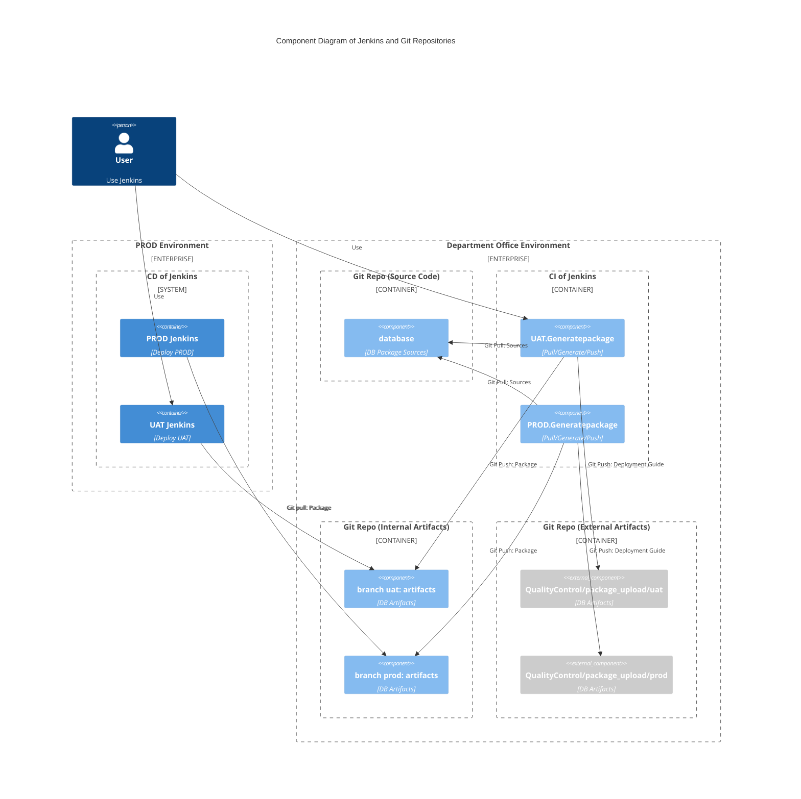

# Sequence Diagrams<!-- omit in toc -->
<!-- table of content -->
- [Abstract](#abstract)
- [C4 Context Diagram of Jenkins and Git Repositories](#c4-context-diagram-of-jenkins-and-git-repositories)
- [`Draw.io` - eCommerceWebSite System Design v1](#drawio---ecommercewebsite-system-design-v1)
  - [`draw.io` Source](#drawio-source)
  - [`draw.io` HTML Preview (Offline)](#drawio-html-preview-offline)
  - [`draw.io` Online Preview](#drawio-online-preview)

## Abstract
> This document provides a detailed overview of the system architecture, emphasizing the use of `mermaid` and `draw.io` for visual representation. 

## C4 Context Diagram of Jenkins and Git Repositories
> The `mermaid` diagrams illustrate the `C4 context diagram` of `Jenkins` and `Git repositories`, showcasing the interactions and relationships between various components. 

## `Draw.io` - eCommerceWebSite System Design v1
> The `draw.io` diagrams offer a comprehensive view of the system architecture and workflow, aiding in the understanding of deployment pipelines, source code management, and artifact handling within the eCommerce system.

### `draw.io` Source
- [System_Design_C4Model_v1.drawio](./eCommerceWebSite/System_Design_C4Model_v1.drawio)
### `draw.io` HTML Preview (Offline)
- [System_Design_C4Model_v1.html](./eCommerceWebSite/System_Design_C4Model_v1.html)
### `draw.io` Online Preview
- https://viewer.diagrams.net/index.html?tags=%7B%7D&highlight=0000ff&edit=_blank&layers=1&nav=1&title=System_Design_C4Model_v1.drawio#Uhttps%3A%2F%2Fraw.githubusercontent.com%2Fmax9159%2Fsystem-design%2Fmain%2Farchitecture%2FeCommerceWebSite%2FSystem_Design_C4Model_v1.drawio