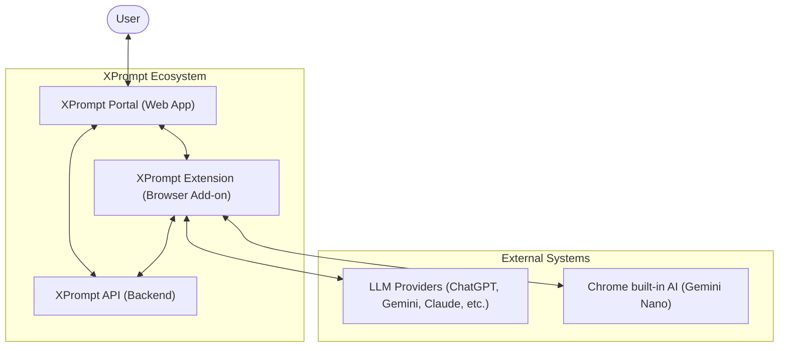
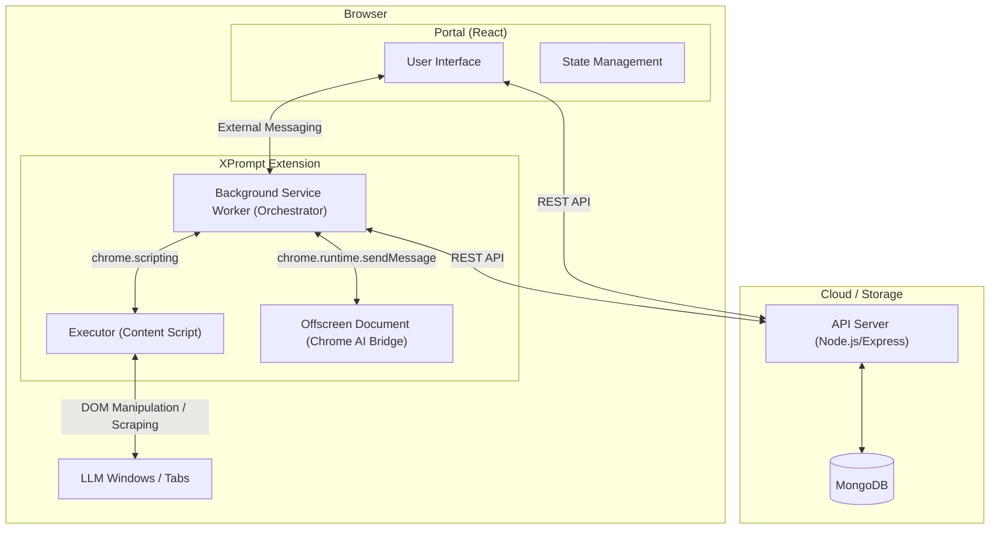
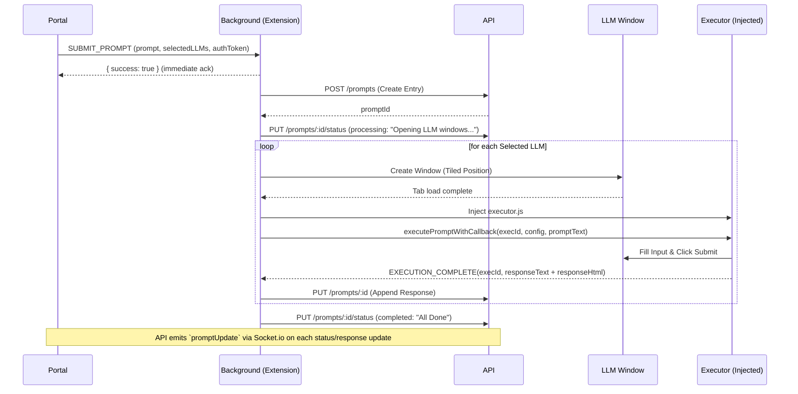
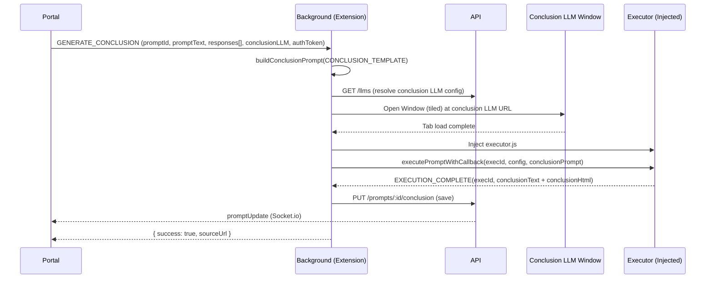
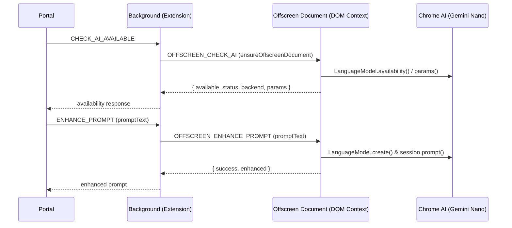
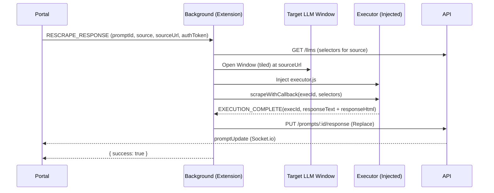

# XPrompt System Design Architecture

XPrompt(https://xprompt.app/) is a multi-LLM orchestration platform that allows users to prompt multiple AI models simultaneously, synthesize their responses, and leverage local Chrome AI for prompt enhancement.

## 1. System Context (C4 Layer 1)

This diagram shows XPrompt in the context of its users and external systems.

---

## 2. Integrated Module Architecture

The following diagram illustrates the internal components and their integration paths.

---

## 3. Core Functions & Flow Charts

### 3.1 Multi-LLM Parallel Submission
This function allows a user to send a single prompt to multiple LLMs simultaneously.

### 3.2 Response Synthesis (Conclusion)
XPrompt can use one LLM to summarize and synthesize responses from all other models.

### 3.3 Local AI Prompt Enhancement
Leverages Chrome Built-in AI Prompt API (`LanguageModel`, with legacy `window.ai` fallback) for privacy-preserving, local prompt optimization.

### 3.4 Dynamic Re-scraping
Allows users to manually refresh a specific response if the initial scraping failed or the user continued the conversation manually.

