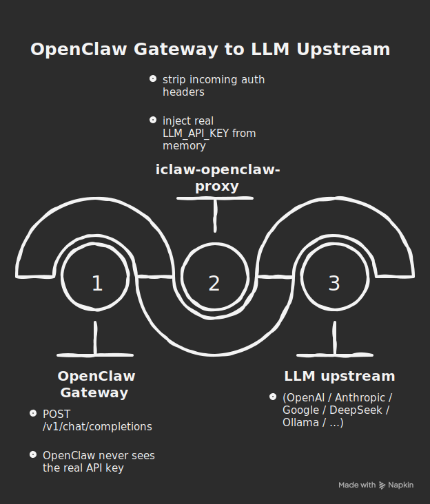

<!-- omit in toc -->
# iclaw-openclaw-proxy
> **The per-instance runtime companion for [OpenClaw](https://github.com/openclaw/openclaw) AI agents on the [iClawAgent](https://github.com/iClawAgent) platform.**

<!-- omit in toc -->
## 📋 Table of Contents

- [Architecture](#architecture)

`iclaw-openclaw-proxy` (internally called the *sidecar*) is a lightweight Bun HTTP server that runs co-located with an OpenClaw gateway process — either in the same  Docker container. It sits between the outside world and OpenClaw and handles three distinct responsibilities:

| Responsibility        | What it does                                                                                                                                                                                             |
| --------------------- | -------------------------------------------------------------------------------------------------------------------------------------------------------------------------------------------------------- |
| **LLM Reverse Proxy** | Intercepts `/v1/*` requests from OpenClaw, enforces per-member daily quotas, injects the LLM API key, and forwards to the configured upstream (OpenAI, Anthropic, or any compatible endpoint)            |
| **Webhook Relay**     | To serve when private network is IPv6-only; OpenClaw's webhook listener binds to IPv4 only. The sidecar (dual-stack via Bun) receives inbound Telegram traffic on IPv6 and relays it to `127.0.0.1:8787` |
| **Admin API**         | An internal `X-Admin-Token`-protected API used by the iClawAgent Orchestrator to rotate credentials, push quota updates, manage workspace files, install skills, and trigger backup/restore              |

---

## Architecture

The sidecar's core role is to be the LLM credential boundary for OpenClaw. OpenClaw is configured to send all LLM requests to the sidecar (`OPENCLAW_LLM_BASE_URL=http://localhost:8080/v1`); the sidecar holds the real API key in memory, enforces quota, and forwards to the upstream provider.



**Made with Napkin (https://www.napkin.ai/), generated by text as below**
```
OpenClaw Gateway :8787 (IPv4 loopback)
    │  POST /v1/chat/completions
    │  (no auth header — OpenClaw never sees the real key)
    ▼
iclaw-openclaw-proxy :8080        ← this package
    │  quota check
    │  strip incoming auth headers
    │  inject real LLM_API_KEY from memory
    ▼
LLM upstream
    (OpenAI / Anthropic / Google / DeepSeek / Ollama / …)
```

Two secondary responsibilities run on the same port:

```
Orchestrator (IPv6)
    │  POST /admin/*  (X-Admin-Token required)
    ▼
iclaw-openclaw-proxy :8080
    │  rotate-key · quota-sync · config-patch
    │  skills · workspace · backup/restore
    ▼
OpenClaw Gateway (RPC :18789 or process signal)

Gatekeeper (public ingress, IPv6)
    │  Telegram webhook relay
    ▼
iclaw-openclaw-proxy :8080
    │  /* relay (IPv6 → IPv4 loopback bridge)
    ▼
OpenClaw Gateway :8787
```

In production each user gets a dedicated container running `iclaw-openclaw` — a composite Docker image that layers this proxy on top of the upstream OpenClaw image. Because both processes share the same machine's loopback interface, all internal communication stays on `127.0.0.1` and never crosses the network.

---

