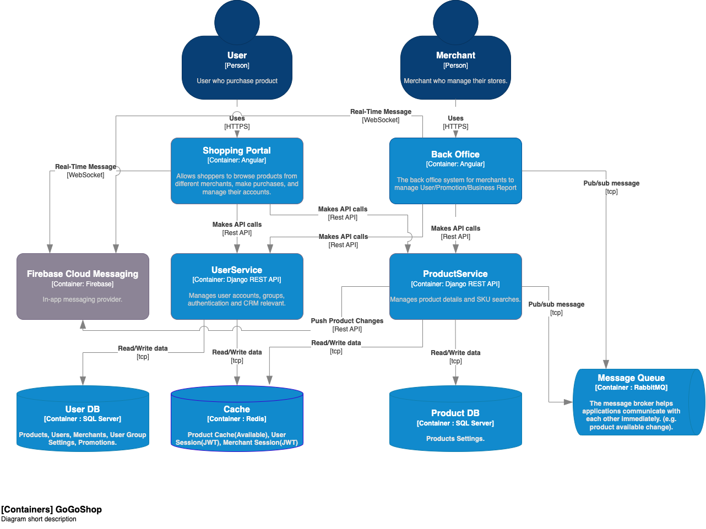
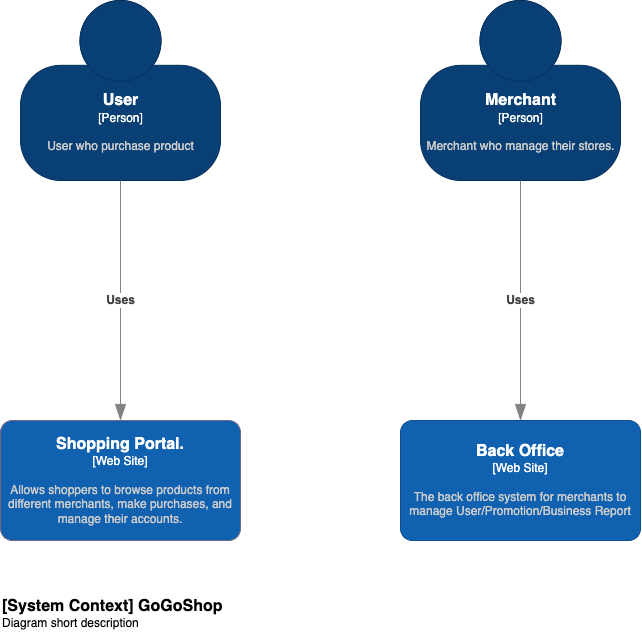

# System Design v1<!-- omit from toc -->

- [1. Analysis of the existing system and its limitations.](#1-analysis-of-the-existing-system-and-its-limitations)
  - [Scalability](#scalability)
  - [Performance \& Crash Issue](#performance--crash-issue)
  - [UI: Outdated, UX: Not a Seamless User Experience.](#ui-outdated-ux-not-a-seamless-user-experience)
  - [UI: Lacks Responsiveness and Real-time](#ui-lacks-responsiveness-and-real-time)
  - [CI/CD \& Source Contorl : Built with mixed](#cicd--source-contorl--built-with-mixed)
- [2. Proposed architectural changes and system proposals from FE perspective.](#2-proposed-architectural-changes-and-system-proposals-from-fe-perspective)
  - [Architecture](#architecture)
  - [Frontend](#frontend)
  - [Backend](#backend)
  - [Authentication](#authentication)
- [3. Description of the development approach, including container level (C4 model) flows, integration points, and third-party integration options if applicable.](#3-description-of-the-development-approach-including-container-level-c4-model-flows-integration-points-and-third-party-integration-options-if-applicable)
  - [Frontend](#frontend-1)
  - [Real-Time Updates](#real-time-updates)
  - [Third-party Integrations](#third-party-integrations)
  - [Container level (C4 model)](#container-level-c4-model)
- [4. Advantages and disadvantages of each approach, including trade-offs, costs, and potential risks.](#4-advantages-and-disadvantages-of-each-approach-including-trade-offs-costs-and-potential-risks)
  - [Advantages](#advantages)
  - [Disadvantages](#disadvantages)
- [5. Any necessary diagrams to illustrate the proposed system design.](#5-any-necessary-diagrams-to-illustrate-the-proposed-system-design)
- [Draw.io Relevant Sources](#drawio-relevant-sources)
  - [draw.io Source](#drawio-source)
  - [draw.io HTML Preview (Offline)](#drawio-html-preview-offline)
  - [draw.io Online Preview](#drawio-online-preview)

# 1. Analysis of the existing system and its limitations. 
## Scalability
- `Monolithic architectures` are difficult to scale. When the users grows, code complexity increases, adding new features can slow down the application and impact performance.

## Performance & Crash Issue
- This is a typical problem with `monolithic architectures`, which can be CPU-bound and have difficulties scaling horizontally.

## UI: Outdated, UX: Not a Seamless User Experience.
- Bad UI/UX will not attracted to user even feature is the best of industry.

## UI: Lacks Responsiveness and Real-time
- For the e-commerce platform, to purchat of product is top one priority, if the platform is not corretly present the product will affect user's intent of purchatment.

## CI/CD & Source Contorl : Built with mixed
- It's not easy to control development life cycle for multiple requirement.
- Dependencies are high, every change has to deploy the entire application.

# 2. Proposed architectural changes and system proposals from FE perspective.
## Architecture
- I propose to rearchitect the system into a `Microservices architecture`. 

## Frontend
- This will allow the backend and frontend to be `developed`, `deployed`, and `scaled` `independently`. 
- The frontend will be a `single-page application (SPA)` developed with a modern JavaScript framework, such as Angular, React or Vue. 
- To improved user experience by allowing for `real-time updates` using technologies like `WebSockets`.

## Backend
- The backend will be several independent services based on business logic with its own database.
  - e.g. **ProductService**: Manages product details and SKU searches. `(ProductService > ProducDB)`
  - e.g. **UserService**: Manages user accounts and authentication. `(UserService > UserDB)`

## Authentication
- To use `JWT(JSON Web Token)` as session authentication on API server and it's `stateless` fulfil the `Microservices architecture`

# 3. Description of the development approach, including container level (C4 model) flows, integration points, and third-party integration options if applicable. 
## Frontend
- The frontend will be a modern `SPA` developed using Angular, React or Vue. This will provide a more responsive user experience. 
- The application will communicate with backend services via `REST APIs` with `JWT`.

## Real-Time Updates
- For real-time updates, we can use `WebSockets`. 
- The Product Service can push product availability updates to the frontend in real-time.

## Third-party Integrations
- **Email**: For email feature, we can integrate with a third-party service like `SendGrid`. 
- **Real-Time & In-app communication**: For Real-Time & in-app communication, we can use a service like `Firebase Cloud Messaging`. 
- **SMS**: For SMS and SNS channels, we can use services like `Twilio`.
## Container level (C4 model)

# 4. Advantages and disadvantages of each approach, including trade-offs, costs, and potential risks. 
## Advantages
- **Scalability**: The Microservices architecture allows each service to `be scaled independently`.
- **Performance**: Microservices allow for `better resource utilization`, leading to improved performance.
- **Real-Time Updates**: By using `Firebase`, we can reduce develop real-time mechanism and hosting new servers then could provide real-time updates to users for multiple platforms (web/app), improving user experience.
- **Email**: By using `SendGrid`, we can reduce mail server hosting.

## Disadvantages
- **Increased Complexity**: The Microservices architecture is `more complex` than a monolithic architecture. We will need to `manage multiple services and databases`, and handle inter-service communication.
- **Data Consistency**: Maintaining `data consistency across services` can be challenging. We need to design the system carefully to handle this.
- **Costs**: While we will get improved performance and scalability, there might be `increased costs` associated with `hosting` and `managing` multiple `services and databases`.
- **3rd-party Costs**: need a further anaysis for cost between using 3rd-party or devlop and own by us.
- **SMS**: Due to we would have `email & in-app messaging feature` therefore, that can set low priority and might postpone to next phase, to consider `development effort` and `maintaining cost`.

# 5. Any necessary diagrams to illustrate the proposed system design.

# Draw.io Relevant Sources
## draw.io Source
- [System_Design_C4Model_v1.drawio](System_Design_C4Model_v1.drawio)
## draw.io HTML Preview (Offline)
- [System_Design_C4Model_v1.html](System_Design_C4Model_v1.html)
## draw.io Online Preview
- https://viewer.diagrams.net/index.html?tags=%7B%7D&highlight=0000ff&edit=_blank&layers=1&nav=1&title=System_Design_C4Model_v1.drawio#Uhttps%3A%2F%2Fraw.githubusercontent.com%2Fmax9159%2Fsystem-design%2Fmain%2Farchitecture%2FeCommerceWebSite%2FSystem_Design_C4Model_v1.drawio