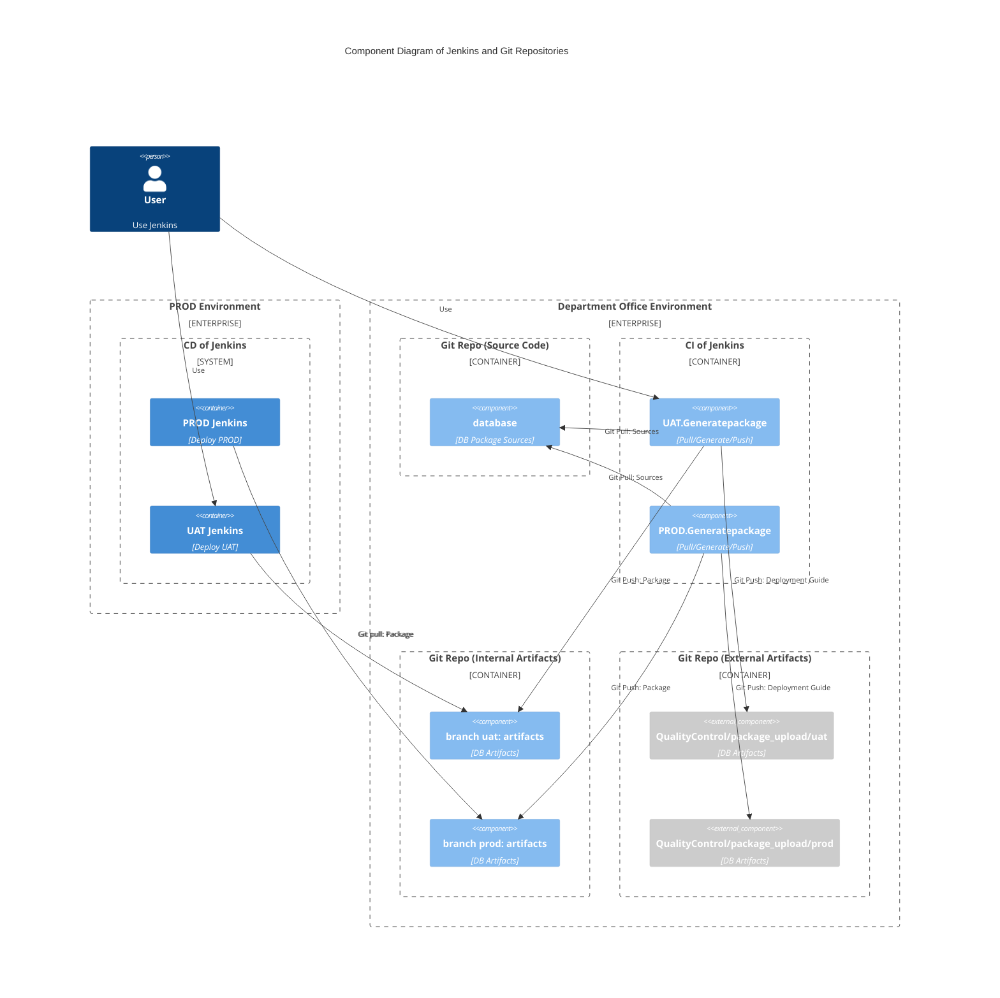

```mermaid
C4Context
    title Component Diagram of Jenkins and Git Repositories
    Person(jenkins_user, "User", "Use Jenkins")
    Enterprise_Boundary(PROD_Env, "PROD Environment") {
        System_Boundary(PRODJks, "CD of Jenkins") {
            Container(cr_jenkins_prod_db, "PROD Jenkins", "Deploy PROD")
            Container(cr_jenkins_uat_db, "UAT Jenkins", "Deploy UAT")
        }
    }
    Enterprise_Boundary(Department_Office, "Department Office Environment") {
        Container_Boundary(gitrepoSource, "Git Repo (Source Code)") {
            Component(git_repo_db_source, "database", "DB Package Sources")
        }

        Container_Boundary(jenkins_r_uat_prod, "CI of Jenkins") {
            Component(jr_uat_db, "UAT.Generatepackage", "Pull/Generate/Push")
            Component(jr_prod_db, "PROD.Generatepackage", "Pull/Generate/Push")
        }
        
        Container_Boundary(gitrepo, "Git Repo (Internal Artifacts)") {
            Component(git_repo_uat_db, "branch uat: artifacts", "DB Artifacts")
            Component(git_repo_prod_db, "branch prod: artifacts", "DB Artifacts")
        }
        Container_Boundary(gitrepoCWD, "Git Repo (External Artifacts)") {
            Component_Ext(git_repo_cwd_uat_db, "QualityControl/package_upload/uat", "DB Artifacts")
            Component_Ext(git_repo_cwd_prod_db, "QualityControl/package_upload/prod", "DB Artifacts")
        }
    }


    Rel(jr_uat_db, git_repo_uat_db, "Git Push: Package")
    Rel(jr_uat_db, git_repo_cwd_uat_db, "Git Push: Deployment Guide")
    Rel(jr_uat_db, git_repo_db_source, "Git Pull: Sources")
    Rel(jr_prod_db, git_repo_prod_db, "Git Push: Package")
    Rel(jr_prod_db, git_repo_cwd_prod_db, "Git Push: Deployment Guide")
    Rel(jr_prod_db, git_repo_db_source, "Git Pull: Sources")
    Rel(cr_jenkins_uat_db, git_repo_uat_db, "Git pull: Package")
    Rel(cr_jenkins_prod_db, git_repo_prod_db, "Git pull: Package")
    Rel(jenkins_user, cr_jenkins_uat_db, "Use")
    Rel(jenkins_user, jr_uat_db, "Use")
```