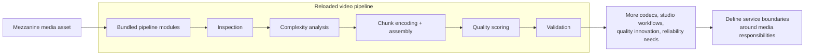
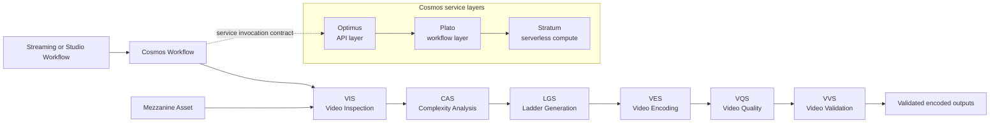
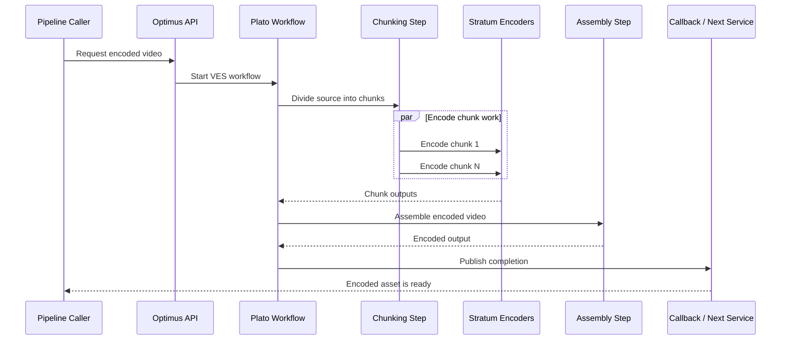

# Netflix Video Processing Pipeline Rebuild

This Netflix case study is most useful as a video-platform architecture lesson. The official pipeline articles explain why a long-lived media pipeline outgrows a bundled platform when new codecs, studio workflows, quality analysis, and service-specific reliability needs all evolve at different speeds.

## Case-Study Focus

- The rebuild from the older Reloaded video pipeline to Cosmos, a workflow-driven platform for media-centric microservices.
- Service boundaries in the video path: inspection, complexity analysis, ladder generation, encoding, quality measurement, and validation.
- The Video Encoding Service (VES) internals that hide chunking, chunk-level work, assembly, and callback aggregation behind a clear service boundary.
- Transferable design lessons for asynchronous media processing systems that need quality, resiliency, and independent service evolution.

## Read This First

Start with the service-boundary split. Netflix's architecture value here is not "upload file then put it on a CDN"; it is how a formerly bundled media pipeline was decomposed around processing responsibilities.

## Source Map

The diagrams below distill official sources collected by [Design Netflix](../../survey/design-netflix-index.md).

| Source | Used for |
| --- | --- |
| [Rebuilding Netflix Video Processing Pipeline with Microservices](https://netflixtechblog.com/rebuilding-netflix-video-processing-pipeline-with-microservices-4e5e6310e359) | Reloaded-to-Cosmos motivation, service boundaries, pipeline services, and workflow-driven media microservices. |
| [The Making of VES](https://netflixtechblog.com/the-making-of-ves-the-cosmos-microservice-for-netflix-video-encoding-946b9b3cd300) | Cosmos layers and the VES encoding workflow around chunking, stratum functions, assembly, and callbacks. |

## Evidence Boundary

**Verified by the source set**

- Netflix rebuilt the pipeline on Cosmos after years of expanding streaming and studio-processing needs made the older Reloaded platform increasingly complex.
- Cosmos microservices use separate API, workflow, and serverless compute layers named Optimus, Plato, and Stratum.
- Netflix split the video pipeline into services with clearer boundaries, including VIS, CAS, LGS, VES, VQS, and VVS.
- VES abstracts distributed chunk-based encoding details so clients request an encoded output rather than orchestrating chunk work themselves.

**Assumptions in these diagrams**

- The diagrams are educational reconstructions from the public articles, not copies of Netflix's internal pipeline diagrams.
- A linear pipeline view is used to show service responsibilities; production workflows can branch, compose services differently, and serve streaming or studio use cases with different requirements.
- Storage, scheduling metadata, retries, observability, and delivery-system integration are abstracted unless the official article makes them central to the service boundary.

## 1. Why The Old Pipeline Needed New Boundaries

Reloaded kept several responsibilities bundled inside a larger platform. Netflix's rebuild starts by identifying boundaries where different analyses and transformations deserve independent service ownership and evolution.

## 2. Cosmos Video Service Topology

The technical core of the rebuild is a workflow-driven composition of media services. Each service should own one processing responsibility while Cosmos provides the platform shape for API entry, workflow orchestration, and compute execution.

## 3. VES Hides Distributed Encoding Complexity

VES is the sharper service-design example. The caller asks for video encoding; the service workflow owns chunk division, parallel chunk encoding, assembly, and output callback behavior. VQS can remain a separate quality service rather than staying bundled inside the encoding module.

## Technical Takeaways

- In processing pipelines, a useful microservice boundary hides an internal execution strategy while exposing a stable media responsibility.
- Chunked parallelism is an implementation detail worth centralizing in the encoding service, not a concern every upstream workflow should reimplement.
- Quality measurement and validation should not be swallowed by encoding when their evaluation logic, scale, and innovation cycle differ.
- A workflow-driven platform is a better abstraction than a synchronous request chain for long-running media work with different latency and resiliency needs.
- Rebuild diagrams should show what changed in service ownership and orchestration, not only the final boxes in delivery order.

## Follow-Up Depth

- Recommendation foundation models deserve a separate Netflix recommendation pack; they solve interaction-data, embedding, cold-start, and downstream-consumer problems rather than media processing.
- Playback startup and Open Connect delivery should also be separate packs unless official control-plane sources are added for the specific playback slice.
