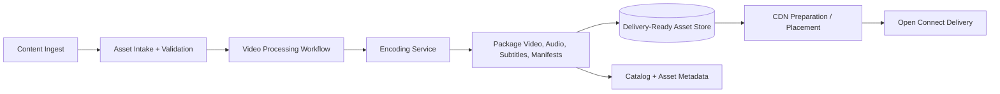
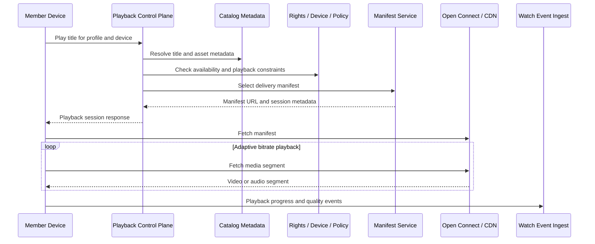
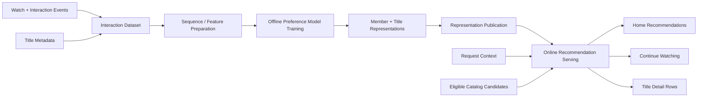

# Design Netflix

Netflix is a strong streaming system design topic because most of the expensive work happens before a viewer presses play. This pack separates delivery-ready asset preparation, low-latency playback startup, and recommendation work so a reader can see which data plane each path needs.

## Product Scope

- Content ingest, processing, encoding, packaging, delivery-ready storage, and CDN preparation.
- Member playback startup, title metadata, playback decisions, manifests, adaptive bitrate media segments, and watch events.
- Personalized recommendation surfaces backed by offline interaction learning and latency-sensitive online consumers.
- Catalog availability, device capability, rights, and playback policy as dependencies at the control-plane boundary.

## Read This First

Start with the content preparation diagram. Playback performance depends on assets that were encoded, packaged, stored, and positioned before a member requests a title.

## Source Map

The first-pass diagrams are distilled from the official sources collected in [Design Netflix](../../survey/design-netflix-index.md) and the recommendation note in [Foundation Model for Personalized Recommendation](../../survey/netflix-recommendation-foundation-model.md).

| Source | Used for |
| --- | --- |
| [Rebuilding Netflix Video Processing Pipeline with Microservices](https://netflixtechblog.com/rebuilding-netflix-video-processing-pipeline-with-microservices-4e5e6310e359) | Video processing decomposition and pre-play workflow boundaries. |
| [The Making of VES](https://netflixtechblog.com/the-making-of-ves-the-cosmos-microservice-for-netflix-video-encoding-946b9b3cd300) | Encoding service responsibilities inside the processing pipeline. |
| [Foundation Model for Personalized Recommendation](https://netflixtechblog.com/foundation-model-for-personalized-recommendation-1a0bd8e02d39) | Shared preference representations, interaction data, and downstream recommendation consumers. |
| [Open Connect: a decade of streaming](https://about.netflix.com/en/news/open-connect-celebrating-a-decade-of-smooth-and-efficient-streaming) | Delivery context and content placement close to members. |

## Evidence Boundary

**Verified by the source set**

- Netflix video delivery depends on a pre-play processing and encoding pipeline.
- Recommendation work can separate interaction learning and representation publication from online consumers.
- Open Connect provides the delivery context for serving prepared content near members.

**Assumptions in these diagrams**

- Service names such as `Playback Control Plane`, `Manifest Service`, and `Recommendation API` are explanatory boundaries.
- The public source set does not describe one current end-to-end playback control plane, so the playback diagram is a reference design grounded in the proven media and delivery boundaries.
- Rights checks, device capability negotiation, experimentation, and DRM are grouped at the startup decision boundary instead of expanded into Netflix-specific internals.

## 1. Content Preparation Pipeline

Viewer playback should reuse delivery-ready outputs. Encoding and packaging work belongs before the request path that a member experiences.

## 2. Playback Startup And Segment Delivery

The control plane starts a viewing session and returns the right manifest. The data plane serves adaptive bitrate segments from prepared delivery assets.

## 3. Recommendation Representations And Online Consumers

Recommendation systems should show offline preparation and online serving separately. Shared member and title representations can support multiple recommendation surfaces.

## Best-Practice Takeaways

- Move heavy encoding, packaging, and delivery preparation out of the member playback path.
- Keep catalog metadata, recommendation representations, watch events, and media segments in separate data planes.
- Draw online recommendation latency separately from offline training and publication workflows.
- Keep playback startup decisions explicit so device, rights, policy, and delivery concerns do not disappear behind a CDN box.

## Coverage Gaps

- The selected public sources do not prove a current Netflix playback control-plane shape end to end.
- Experimentation, DRM, ad-supported playback, and detailed watch-history consistency are useful follow-up topics only after adding official sources for those slices.
