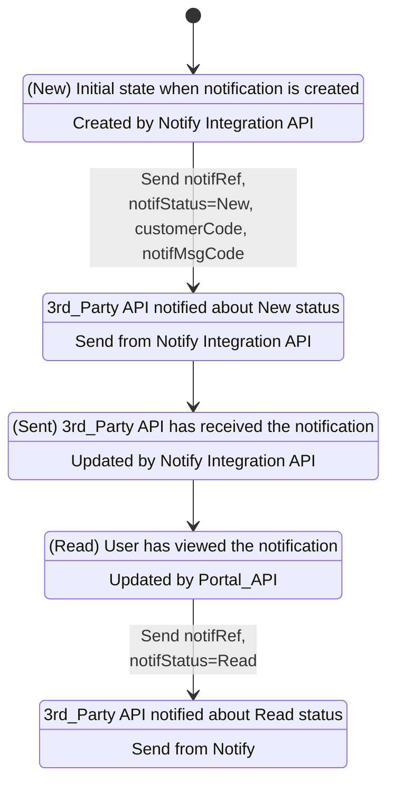
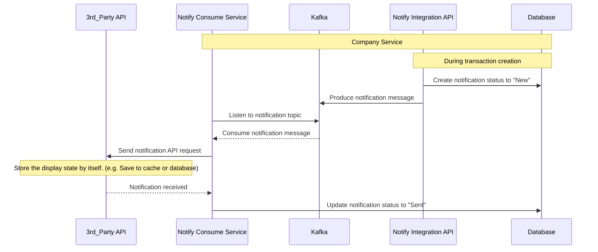
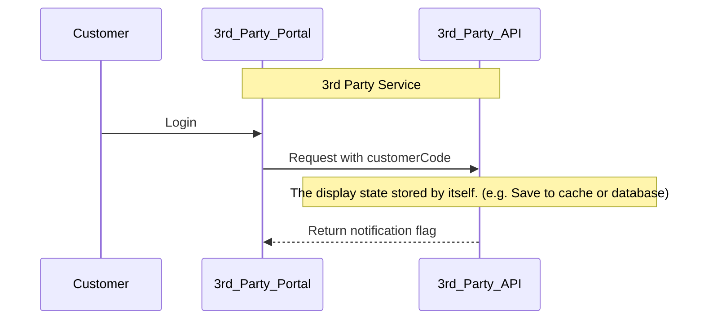
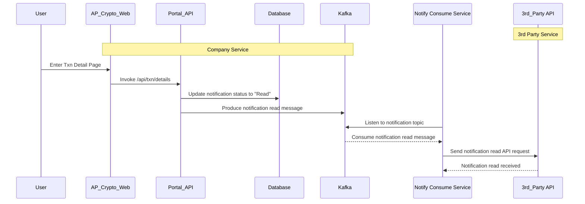
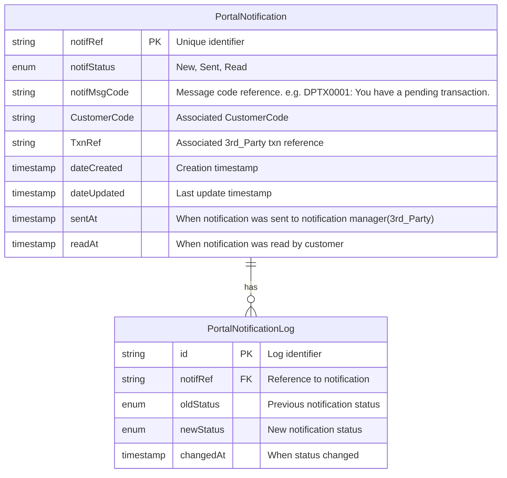

# Sync Status with 3rd Party <!-- omit from toc -->
- [📊 State Diagram - Notification Status Flow](#-state-diagram---notification-status-flow)
- [🔁 Sequence Diagram - Popup Notification (Send Process)](#-sequence-diagram---popup-notification-send-process)
- [🔁 Sequence Diagram - Popup Notification (Display Handling by Self)](#-sequence-diagram---popup-notification-display-handling-by-self)
- [🔁 Sequence Diagram - Popup Notification (Read Process)](#-sequence-diagram---popup-notification-read-process)
- [📊 Database Schema - PortalNotification System](#-database-schema---portalnotification-system)

### Overview
> This document describes the system design for syncing the status of a notification with a 3rd party.
> Using `state diagram`, `sequence diagram`, and `database schema` with `mermaid` to describe the system design.

### 📊 State Diagram - Notification Status Flow

### 🔁 Sequence Diagram - Popup Notification (Send Process)

### 🔁 Sequence Diagram - Popup Notification (Display Handling by Self)

### 🔁 Sequence Diagram - Popup Notification (Read Process)

### 📊 Database Schema - PortalNotification System
