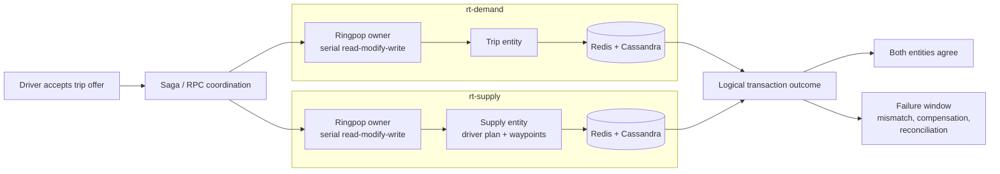
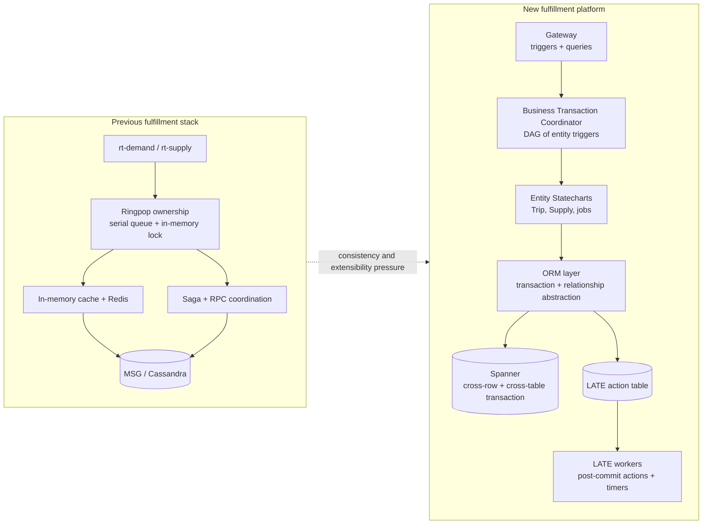
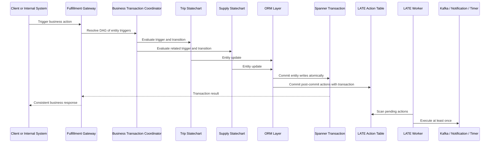

<!-- omit in toc -->
# Uber Fulfillment Platform Re-architecture
> This Uber case study is more useful than a generic "request a ride" diagram. The official Fulfillment articles explain why lifecycle-heavy marketplace systems become hard to evolve when one business action must update several entities, emit side effects, survive retries, and keep a consistent view for consumers.

<!-- omit in toc -->
## 📋 Table of Contents

- [Case-Study Focus](#case-study-focus)
- [Read This First](#read-this-first)
- [Source Map](#source-map)
- [Evidence Boundary](#evidence-boundary)
- [1. Why The Previous Write Path Became Hard](#1-why-the-previous-write-path-became-hard)
- [2. What The Rebuild Changes](#2-what-the-rebuild-changes)
- [3. Transactional Trigger And Durable Side Effects](#3-transactional-trigger-and-durable-side-effects)
- [Technical Takeaways](#technical-takeaways)
- [Follow-Up Depth](#follow-up-depth)

## Case-Study Focus

- Fulfillment entities such as `Trip` and `Supply`, not pricing, routing, or the dispatch algorithm.
- The previous architecture's availability-first write model and its multi-entity consistency cost.
- The new programming model built around statecharts, a Business Transaction Coordinator, an ORM layer, Spanner transactions, and durable post-commit work.
- Technical patterns that transfer to order orchestration, delivery, booking, and other multi-entity lifecycle systems.

## Read This First

Start with the old multi-entity write problem. It explains why Uber's rebuild matters before looking at Spanner or the new framework components.

## Source Map

The diagrams below distill the official sources collected by [Design Uber](../../survey/design-uber-index.md).

| Source | Used for |
| --- | --- |
| [Uber Fulfillment Platform re-architecture](https://www.uber.com/blog/fulfillment-platform-rearchitecture/) | Previous architecture problems, Trip and Supply entities, new programming model, LATE, and the application architecture components. |
| [Building Uber's Fulfillment Platform using Spanner](https://www.uber.com/blog/building-ubers-fulfillment-platform/) | Why consistency became a selection criterion and what Spanner contributes to multi-row, multi-table transactions. |

## Evidence Boundary

**Verified by the source set**

- A driver accepting a trip offer is a multi-entity write: the Trip entity changes and the Supply plan gains trip waypoints.
- The previous stack used `rt-demand` and `rt-supply` over Cassandra and Redis, Ringpop serialization, and Saga coordination for cross-entity work.
- Uber moved fulfillment storage to Spanner for transactional consistency, horizontal scalability, and lower operational overhead.
- The new application model centers on statecharts, a Business Transaction Coordinator, and an ORM layer; post-commit operations and timers are committed to a LATE action table for at-least-once execution.

**Assumptions in these diagrams**

- The diagrams are educational reconstructions from the public articles, not copies of Uber's internal diagrams or a current service inventory.
- The examples use the simple UberX `Trip` and `Supply` terms because the official article uses them to explain the platform.
- RPC endpoints, table names beyond the published LATE action table concept, retries, and observability hooks are intentionally abstracted.

## 1. Why The Previous Write Path Became Hard

One acceptance action touches both demand and supply state. In the previous architecture, application-layer coordination could leave entities temporarily inconsistent between operations and made cross-service debugging harder as flows became more complex.

## 2. What The Rebuild Changes

The rebuild is not just a database swap. It moves business lifecycle modeling, multi-entity coordination, transaction abstraction, and post-commit work into explicit platform components. The previous stack favored availability through application sharding and best-effort coordination; the new requirements call out strong consistency for multi-row and multi-table transactions.

## 3. Transactional Trigger And Durable Side Effects

The new programming model lets a trigger coordinate entity transitions inside one read-write transaction. Side effects that should run after commit, such as notifications or Kafka publication, need a durable handoff instead of being silently coupled to the transaction response path.

## Technical Takeaways

- Start by drawing the business transaction boundary. If one user action mutates several lifecycle entities, generic microservice boxes hide the hardest part.
- State machines help make transitions explicit, but they need a transaction model when multiple entities must change together.
- A consistency upgrade changes the programming model too: write coordination, data abstraction, and extension points need to become platform concepts.
- Post-commit effects need a durable handoff if they matter after the transaction commits; "send an event after write" is not enough design detail.
- Storage selection is workload-specific. Uber selected Spanner around transactional consistency, horizontal scale, and operational overhead for fulfillment, not as a blanket answer for every Uber subsystem.

## Follow-Up Depth

- Add a storage topology page only when the design needs Uber-to-GCP network redundancy, multi-region Spanner placement, failover latency, or cost modeling.
- Keep H3, real-time mobile push, ETA, and pricing in separate packs. They solve different technical problems than fulfillment write correctness.
