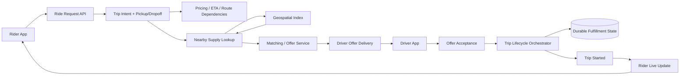
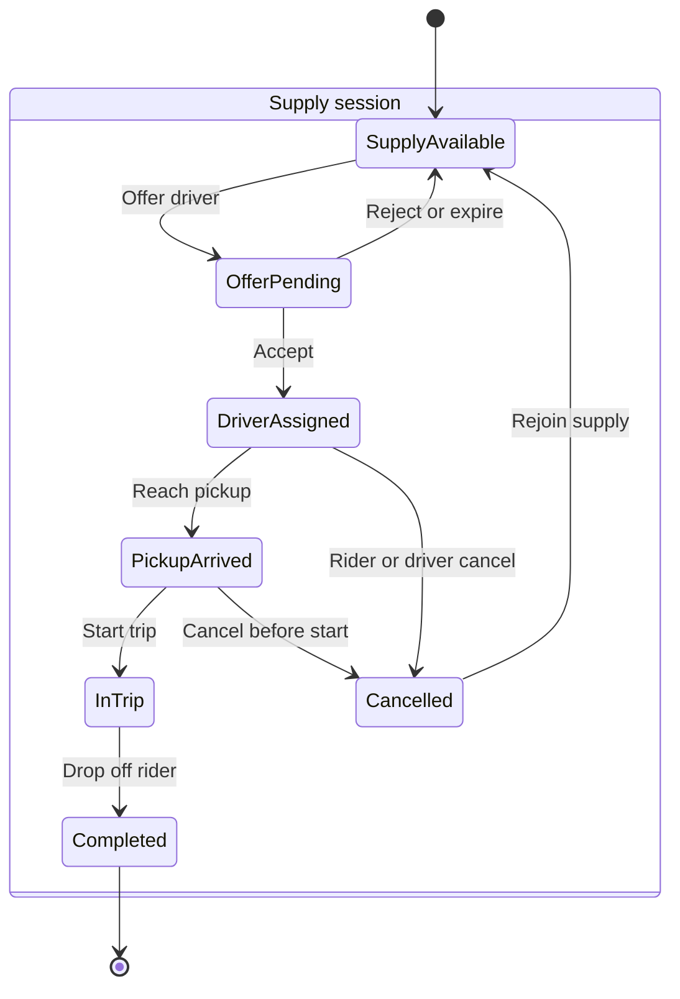
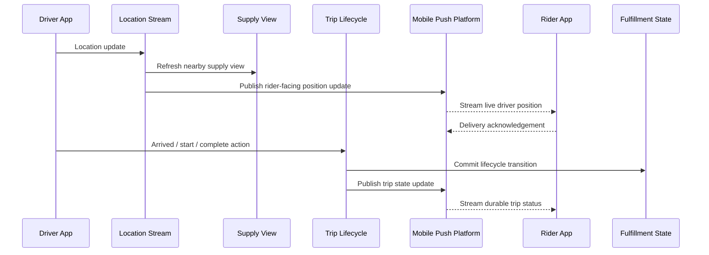

# Design Uber

Uber is a useful ride-hailing system design topic because one user action crosses marketplace search, durable trip state, mobile delivery, and high-frequency location telemetry. This pack starts with the ride path that a reader needs first, then separates the lifecycle and live-update concerns that should not be collapsed into one service.

## Product Scope

- Rider trip requests, driver supply sessions, offers, acceptances, pickup, in-trip progress, dropoff, cancellation, and receipts.
- Nearby driver candidate lookup, geospatial indexing, lifecycle orchestration, and real-time rider updates.
- Durable trip state and mobile update delivery as distinct correctness problems.
- Pricing, ETA calculation, routing, and payment as adjacent dependencies rather than the core focus of this first pass.

## Read This First

Start with the ride request diagram. It shows why geospatial lookup finds candidates while a trip workflow owns state transitions and offer acceptance.

## Source Map

The first-pass diagrams are distilled from the official sources collected in [Design Uber](../../survey/design-uber-index.md) and the push-delivery note in [Uber's Next Gen Push Platform on gRPC](../../survey/uber-realtime-push-platform.md).

| Source | Used for |
| --- | --- |
| [Uber Fulfillment Platform re-architecture](https://www.uber.com/blog/fulfillment-platform-rearchitecture/) | Trip and Supply domain split, lifecycle orchestration, and statechart thinking. |
| [Building Uber's Fulfillment Platform using Spanner](https://www.uber.com/blog/building-ubers-fulfillment-platform/) | Durable and globally consistent fulfillment state. |
| [Uber's Next Gen Push Platform on gRPC](https://www.uber.com/us/en/blog/ubers-next-gen-push-platform-on-grpc/) | Persistent mobile streams, delivery acknowledgements, and real-time push responsibilities. |
| [H3: Uber's Hexagonal Hierarchical Spatial Index](https://www.uber.com/blog/h3/) | Geospatial candidate lookup context. |

## Evidence Boundary

**Verified by the source set**

- Uber models fulfillment around Trip and Supply domains with explicit lifecycle orchestration.
- Ongoing fulfillment state needs stronger durability and consistency than transient location updates.
- Uber uses geospatial indexing context for marketplace work and a mobile push platform for live delivery.

**Assumptions in these diagrams**

- Service names such as `Ride Request API`, `Matching / Offer Service`, and `Location Stream` are explanatory boundaries, not copied Uber public APIs.
- Pricing, ETA, routing, fraud checks, and payment are shown only as dependencies where they affect the ride path.
- The final candidate selection algorithm is left behind the matching boundary because the survey batch does not prove its current internals.

## 1. Ride Request To Trip Start

The request path keeps marketplace search separate from the durable workflow that records an accepted offer and starts the trip.

## 2. Trip And Supply Lifecycle

An explicit lifecycle avoids mixing candidate discovery with state changes that must survive retries, disconnects, and cancellation edges.

## 3. Live Location And Rider Updates

Location data can arrive much more often than lifecycle transitions. The live path should stream and fan out observations without making every coordinate update a transactional trip write.

## Best-Practice Takeaways

- Keep high-frequency telemetry away from the transactional write path for core trip state.
- Model trip and supply transitions explicitly before adding pricing, ETA, payment, and notifications.
- Use geospatial lookup to narrow candidates; make offer acceptance a separate correctness boundary.
- Treat mobile delivery reliability, acknowledgement, and reconnect behavior as platform concerns instead of embedding them in every domain service.

## Coverage Gaps

- The current source set is stronger on fulfillment, consistency, geospatial context, and push delivery than on pricing and ETA internals.
- Matching internals are intentionally abstract here; add official sources before turning them into a detailed dispatch algorithm diagram.
