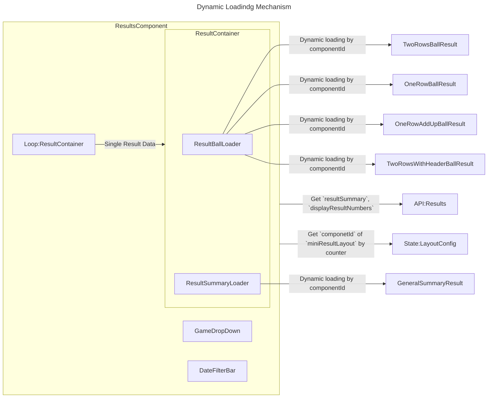

```mermaid
---
title: Dynamic Loadindg Mechanism
---
flowchart LR
    subgraph ResultsComponent
        GameDropDown
        DateFilterBar
        Loop:ResultContainer
        subgraph ResultContainer
            ResultBallLoader
            ResultSummaryLoader
        end
    end

ResultsComponent -- Get `resultSummary`, `displayResultNumbers`  --> API:Results
ResultsComponent -- Get `componetId` of `miniResultLayout` by counter  --> State:LayoutConfig
Loop:ResultContainer -- Single Result Data --> ResultContainer

ResultSummaryLoader -- Dynamic loading by componentId --> GeneralSummaryResult
ResultBallLoader -- Dynamic loading by componentId --> TwoRowsBallResult
ResultBallLoader -- Dynamic loading by componentId --> OneRowBallResult
ResultBallLoader -- Dynamic loading by componentId --> OneRowAddUpBallResult
ResultBallLoader -- Dynamic loading by componentId --> TwoRowsWithHeaderBallResult

```
