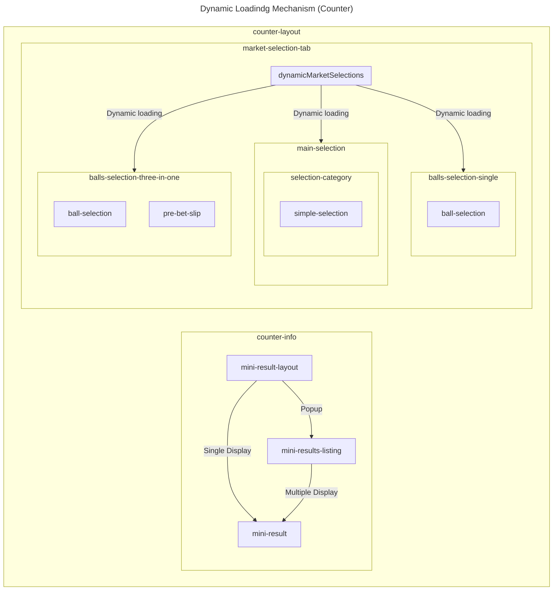

```mermaid
---
title: Dynamic Loadindg Mechanism (Counter)
---
flowchart TB
    subgraph counter-layout
        subgraph counter-info
          mini-result-layout
          mini-results-listing
          mini-result
        end
        subgraph market-selection-tab
		  subgraph dynamicMarketSelections
          end
          subgraph main-selection
            subgraph selection-category 
              simple-selection
            end
          end
          subgraph balls-selection-single
            D[ball-selection]
          end
          subgraph balls-selection-three-in-one
            E[ball-selection]
            pre-bet-slip
          end
        end
    end
dynamicMarketSelections --Dynamic loading--> main-selection
dynamicMarketSelections --Dynamic loading--> balls-selection-single
dynamicMarketSelections --Dynamic loading--> balls-selection-three-in-one
mini-result-layout -- Popup --> mini-results-listing
mini-result-layout -- Single Display --> mini-result
mini-results-listing -- Multiple Display  --> mini-result
```
