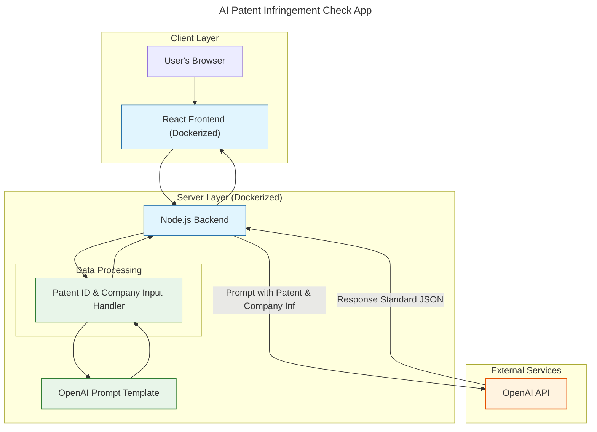

```mermaid
---
title: AI Patent Infringement Check App
---
flowchart TB
    subgraph Client["Client Layer"]
        Browser["User's Browser"]
        Frontend["React Frontend (Dockerized)"]
    end

    subgraph Backend["Server Layer (Dockerized)"]
        NodeBackend["Node.js Backend"]
        Template["OpenAI Prompt Template"]
        
        subgraph Processing["Data Processing"]
            InputHandler["Patent ID & Company Input Handler"]
        end
    end

    subgraph External["External Services"]
        OpenAI["OpenAI API"]
    end

    Browser --> Frontend
    Frontend --> NodeBackend
    NodeBackend --> InputHandler
    InputHandler --> Template
    Template --> InputHandler
    InputHandler --> NodeBackend
    NodeBackend --Prompt with Patent & Company Info--> OpenAI
    OpenAI --Response Standard JSON--> NodeBackend
    NodeBackend --> Frontend

    classDef docker fill:#e1f5fe,stroke:#01579b
    classDef process fill:#e8f5e9,stroke:#2e7d32
    classDef External fill:#fff3e0,stroke:#e65100
    
    class Frontend,NodeBackend docker
    class InputHandler,Template process
    class OpenAI,Standard External
```
