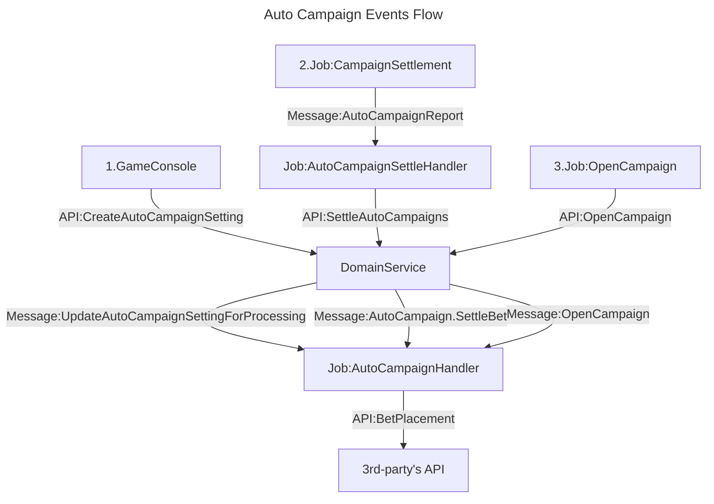

```mermaid
---
title: Auto Campaign Events Flow
---
flowchart TD; 
D[1.GameConsole] -->|API:CreateAutoCampaignSetting| A[DomainService]; 
A --> |Message:UpdateAutoCampaignSettingForProcessing| B[Job:AutoCampaignHandler];
C[2.Job:CampaignSettlement] -->|Message:AutoCampaignReport| E[Job:AutoCampaignSettleHandler]; 
E --> |API:SettleAutoCampaigns| A;
A --> |Message:AutoCampaign.SettleBet| B;
F[3.Job:OpenCampaign] --> |API:OpenCampaign| A;
A --> |Message:OpenCampaign| B;
B --> |API:BetPlacement| H[3rd-party's API]
```
