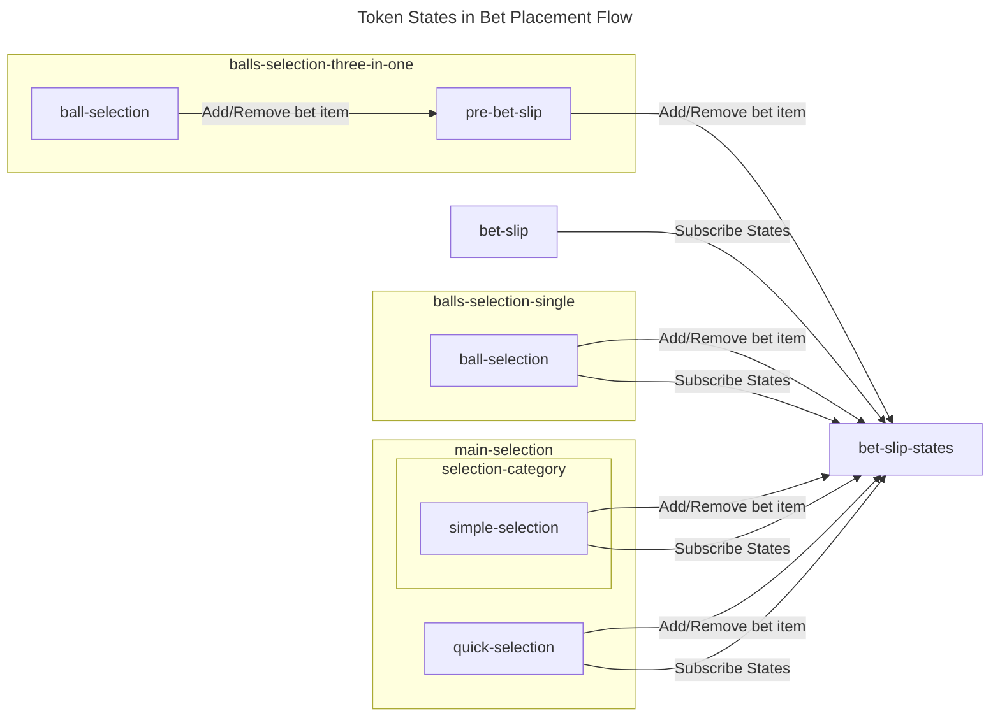

```mermaid
---
title: Token States in Bet Placement Flow
---
graph LR
          subgraph main-selection
            subgraph selection-category 
              simple-selection
            end
            quick-selection
          end
          subgraph balls-selection-single
            D[ball-selection]
          end
          subgraph balls-selection-three-in-one
            E[ball-selection]
            pre-bet-slip
          end
		bet-slip
		bet-slip-states
simple-selection --Add/Remove bet item--> bet-slip-states;
quick-selection --Add/Remove bet item--> bet-slip-states;
D[ball-selection] --Add/Remove bet item--> bet-slip-states;
E[ball-selection] --Add/Remove bet item--> pre-bet-slip;
pre-bet-slip --Add/Remove bet item--> bet-slip-states;
bet-slip --Subscribe States--> bet-slip-states;
D[ball-selection] --Subscribe States--> bet-slip-states;
simple-selection --Subscribe States--> bet-slip-states;
quick-selection --Subscribe States--> bet-slip-states;
```
