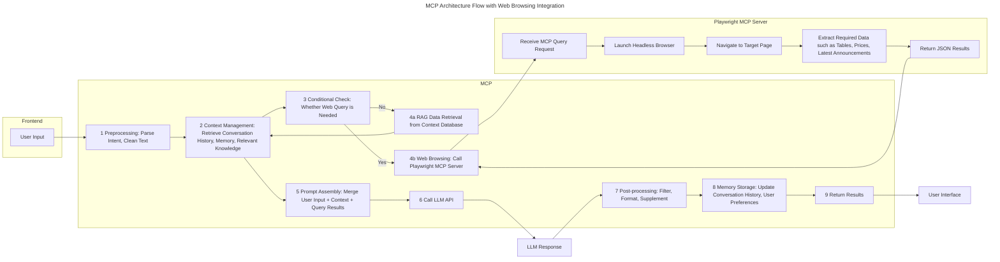

 > The diagram shows an `MCP` (Model Context Protocol) architecture with three main components: Frontend, MCP processing pipeline, and `Playwright` `MCP Server` for web browsing functionality.

```mermaid
---
title: MCP Architecture Flow with Web Browsing Integration
---
flowchart LR
    subgraph Frontend
      A[User Input] 
    end

    subgraph MCP
      B1[1 Preprocessing: Parse Intent, Clean Text]
      B2[2 Context Management: Retrieve Conversation History, Memory, Relevant Knowledge]
      B3[3 Conditional Check: Whether Web Query is Needed]
      B4a[4a RAG Data Retrieval from Context Database]
      B5[4b Web Browsing: Call Playwright MCP Server]
      B6[5 Prompt Assembly: Merge User Input + Context + Query Results]
      B7[6 Call LLM API]
      B8[7 Post-processing: Filter, Format, Supplement]
      B9[8 Memory Storage: Update Conversation History, User Preferences]
      B10[9 Return Results]
    end

    subgraph Playwright MCP Server
      P1[Receive MCP Query Request]
      P2[Launch Headless Browser]
      P3[Navigate to Target Page]
      P4[Extract Required Data such as Tables, Prices, Latest Announcements]
      P5[Return JSON Results]
    end


    A --> B1 --> B2 --> B3
    B3 -- Yes --> B5
    B3 -- No --> B4a
    B4a --> B2
    B5 --> P1 --> P2 --> P3 --> P4 --> P5 --> B5
    B2 --> B6
    B6 --> B7--> E[LLM Response]
    E --> B8 --> B9 --> B10 --> F[User Interface]
```