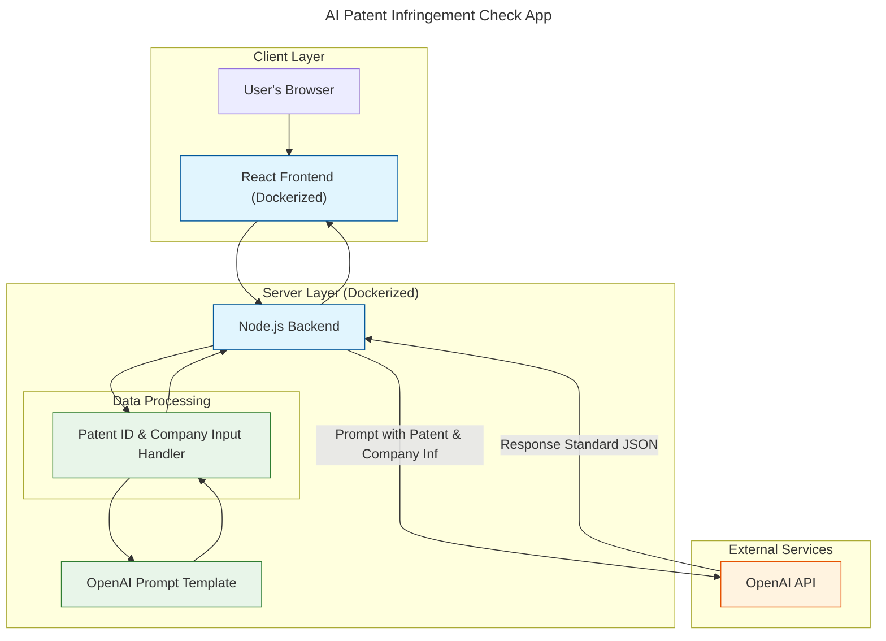
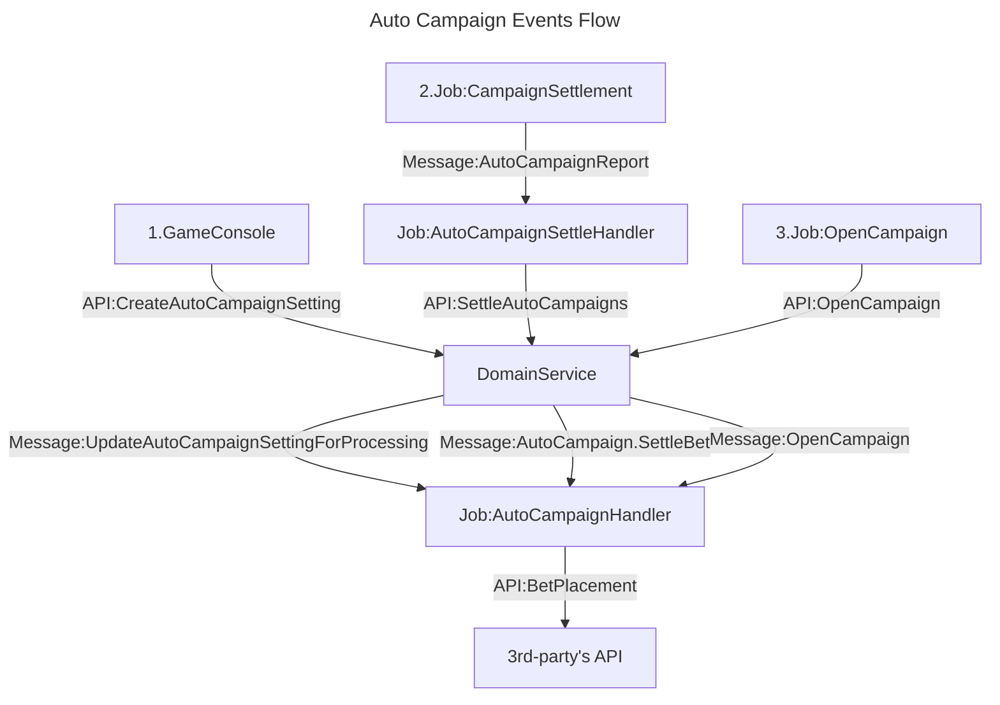
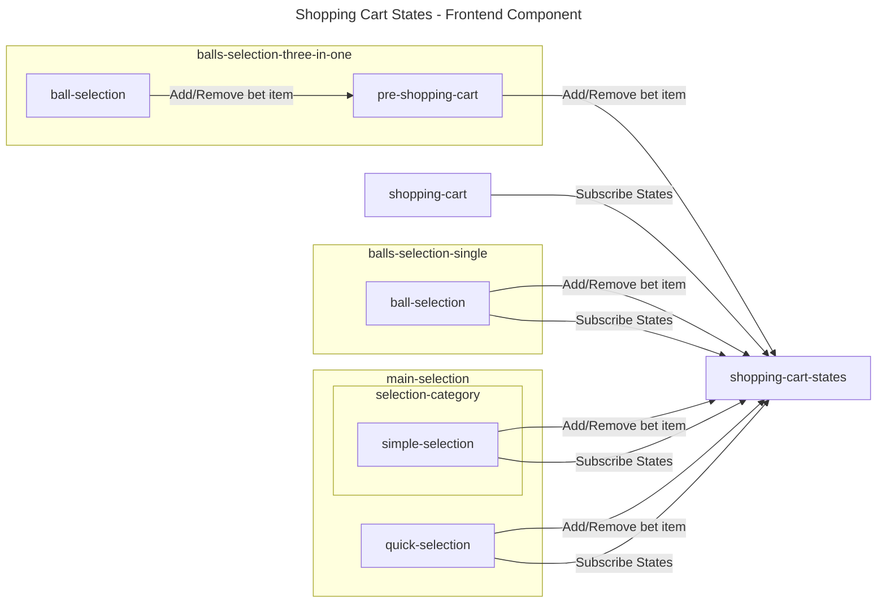
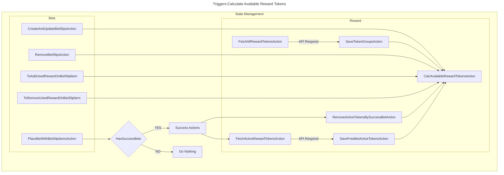
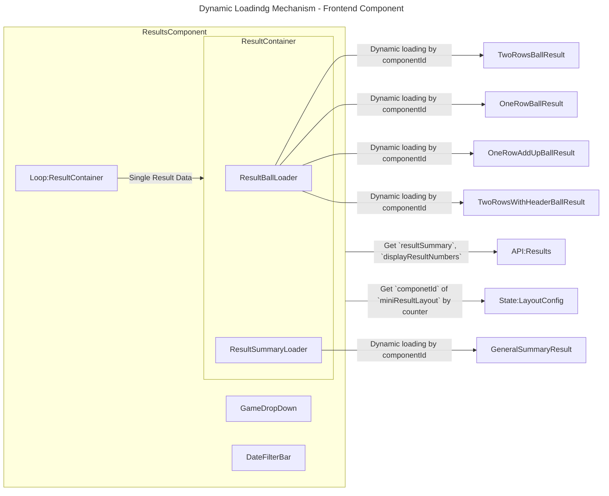
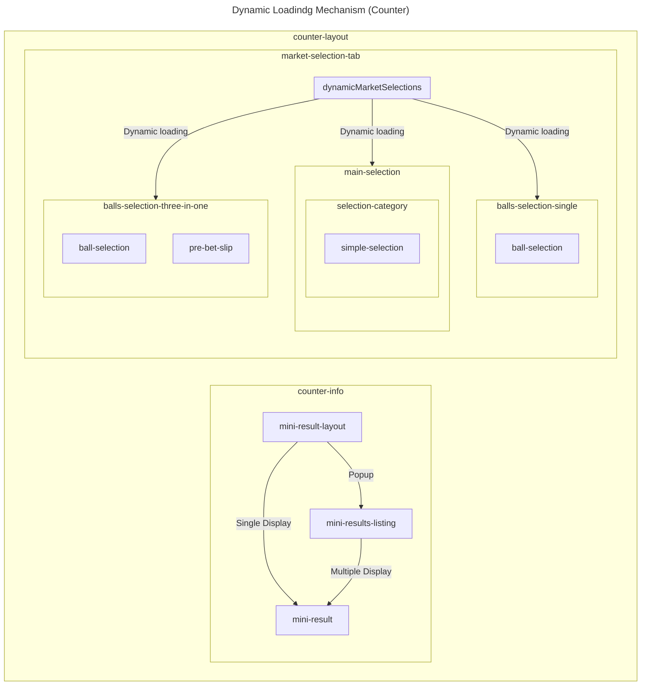

<!-- table of content -->
- [Abstract](#abstract)
- [AI Patent Infringement Check App](#ai-patent-infringement-check-app)
- [Auto Campaign Events Flow](#auto-campaign-events-flow)
- [Shopping Cart States - Frontend Component](#shopping-cart-states---frontend-component)
- [Triggers - Calculate Available Reward Tokens](#triggers---calculate-available-reward-tokens)
- [Dynamic Loadindg Mechanism - Frontend Component (Left to Right)](#dynamic-loadindg-mechanism---frontend-component-left-to-right)
- [Dynamic Loadindg Mechanism - Frontend Component (Top to Bottom)](#dynamic-loadindg-mechanism---frontend-component-top-to-bottom)

## Abstract
This document provides a collection of `flowcharts` that **describe various processes and systems** in the context of software development. These flowcharts are created using the `Mermaid` syntax and are designed to help `visualize` the flow of data, events, and interactions within a system.

## AI Patent Infringement Check App

## Auto Campaign Events Flow

## Shopping Cart States - Frontend Component

## Triggers - Calculate Available Reward Tokens

## Dynamic Loadindg Mechanism - Frontend Component (Left to Right)

## Dynamic Loadindg Mechanism - Frontend Component (Top to Bottom)

