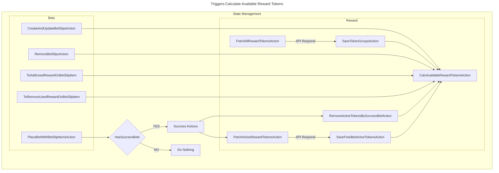

```mermaid
---
title: Triggers:Calculate Available Reward Tokens
---
flowchart 
    subgraph State Management
        subgraph Bets
            CreateAndUpdateBetSlipsAction
            RemoveBetSlipsAction
            ToAddUsedRewardOnBetSlipItem
            ToRemoveUsedRewardOnBetSlipItem
            P[PlaceBetWithBetSlipItemsAction]
        end
        S{HasSuccessBets}
        N[Do Nothing]
        Y[Success Actions]
        subgraph Reward
            SaveFreeBetActiveTokensAction
            SaveTokenGroupsAction
            RemoveActiveTokensBySuccessBetAction
            FetchActiveRewardTokensAction
            FetchAllRewardTokensAction
            CalcAvailableRewardTokensAction
        end
        
    end

CreateAndUpdateBetSlipsAction --> CalcAvailableRewardTokensAction
RemoveBetSlipsAction --> CalcAvailableRewardTokensAction
ToAddUsedRewardOnBetSlipItem --> CalcAvailableRewardTokensAction
ToRemoveUsedRewardOnBetSlipItem --> CalcAvailableRewardTokensAction
P-->S
S--YES--> Y
Y-->RemoveActiveTokensBySuccessBetAction --> CalcAvailableRewardTokensAction
Y--> FetchActiveRewardTokensAction
S--NO--> N
FetchActiveRewardTokensAction --API Respond--> SaveFreeBetActiveTokensAction--> CalcAvailableRewardTokensAction

FetchAllRewardTokensAction --API Respond--> SaveTokenGroupsAction
SaveTokenGroupsAction --> CalcAvailableRewardTokensAction

```
