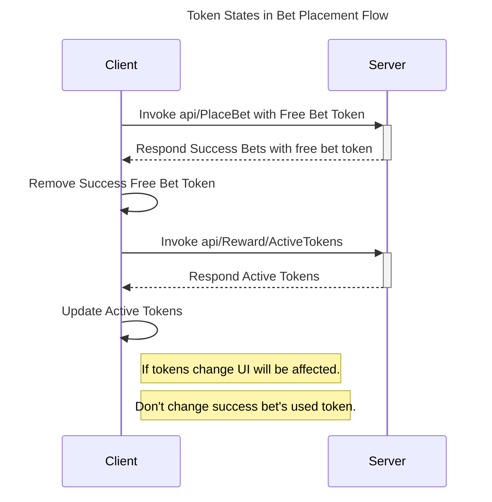

```mermaid
---
title: Token States in Bet Placement Flow
---
sequenceDiagram
    Client->>+Server: Invoke api/PlaceBet with Free Bet Token
    Server-->>-Client: Respond Success Bets with free bet token
    Client->>Client: Remove Success Free Bet Token
    Client->>+Server: Invoke api/Reward/ActiveTokens
    Server-->>-Client: Respond Active Tokens
    Client->>Client : Update Active Tokens 
    Note right of Client: If tokens change UI will be affected.
    Note right of Client: Don't change success bet's used token.
```
