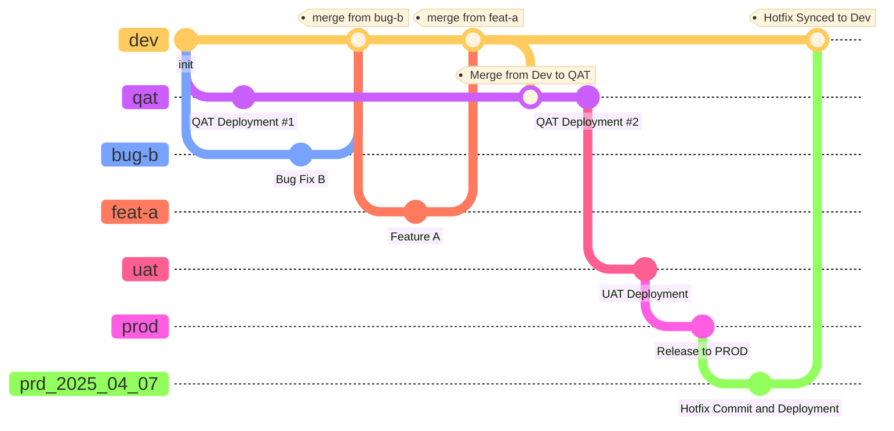

### Git Flow in Real World
- Normal: from `dev` > `qat` > `uat` > `prod` branch
- Hotfix: create branch from `prod`, name as `prd_{date}` branch and also sync back to `dev` branch

```mermaid
%%{init: { 'logLevel': 'debug', 'theme': 'base', 'gitGraph': {'rotateCommitLabel': false,'showBranches': true, 'showCommitLabel':true,'mainBranchName': 'dev'}} }%%
gitGraph
    commit id: "init"
    checkout dev
    branch qat
    commit id: "QAT Deployment #1"

    checkout dev    
    branch bug-b
    commit id: "Bug Fix B"
    checkout dev
    merge bug-b tag: "merge from bug-b"
    branch feat-a
    commit id: "Feature A"
    checkout dev
    merge feat-a tag: "merge from feat-a"
    checkout qat
    merge dev tag: "Merge from Dev to QAT"
    commit id: "QAT Deployment #2"
    branch uat
    checkout uat
    commit id: "UAT Deployment"
    branch prod
    checkout prod
    commit id: "Release to PROD"

    %% Hotfix flow
    branch prd_2025_04_07
    checkout prd_2025_04_07
    commit id: "Hotfix Commit and Deployment"
    checkout dev
    merge prd_2025_04_07 tag: "Hotfix Synced to Dev"
```