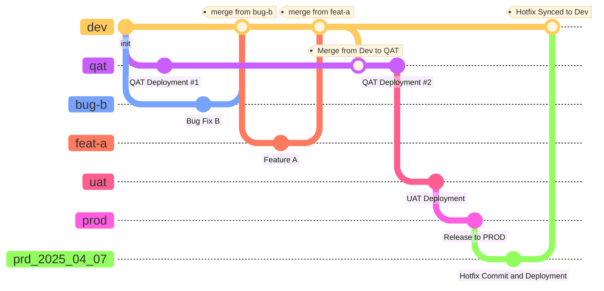

# Git Flow in Real World
> A branching and deployment strategy for real-world git flow — normal releases promote `dev` → `qat` → `uat` → `prod`, while a hotfix branches from `prod` as `prd_{date}` and syncs back to `dev`.

