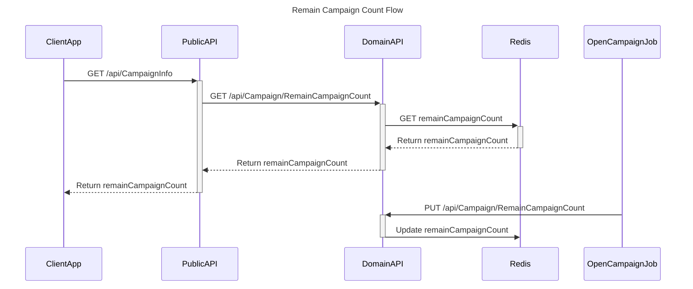
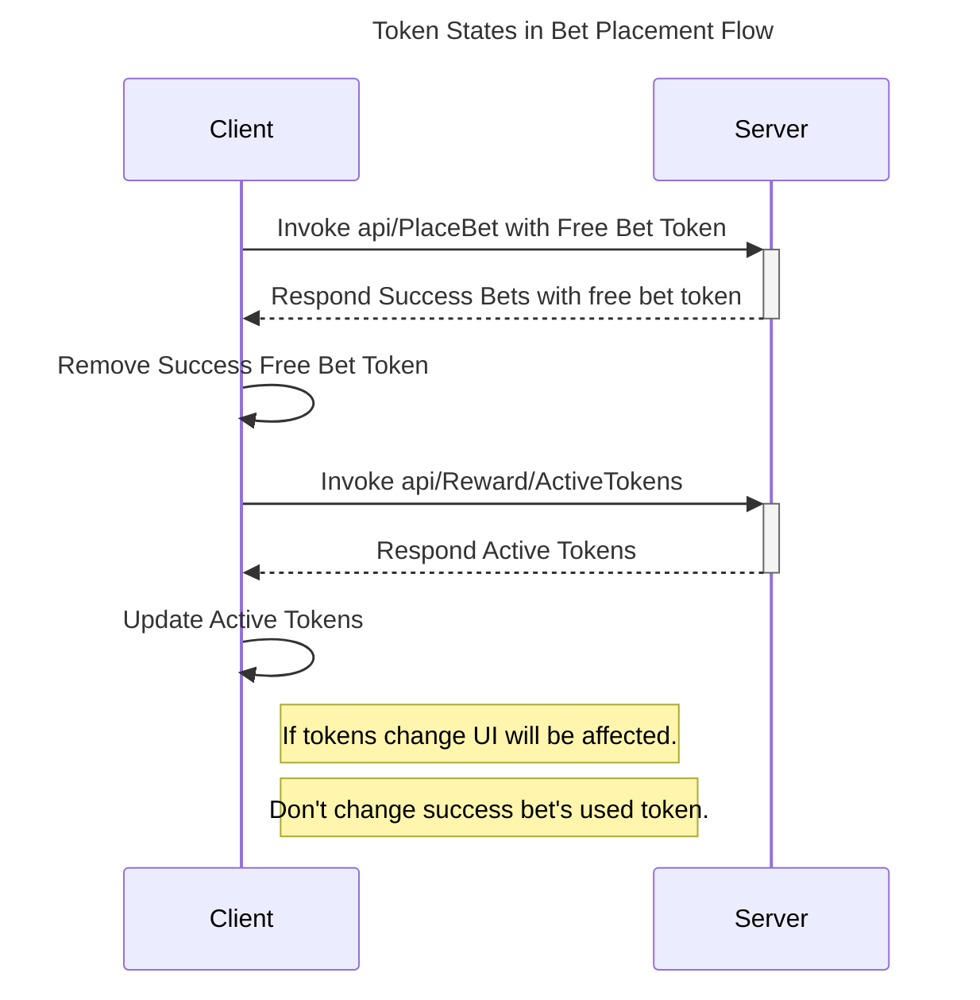

# Sequence Diagrams<!-- omit in toc -->
<!-- table of content -->
- [Abstract](#abstract)
- [Remaining Campaign Count Flow](#remaining-campaign-count-flow)
- [Token States in Bet Placement Flow](#token-states-in-bet-placement-flow)

## Abstract
This document provides a collection of `sequence diagrams` that **describe various processes and systems** in the context of software development. These sequence diagrams are created using the `Mermaid` syntax and are designed to help `visualize` the flow of data, events, and interactions within a system.

## Remaining Campaign Count Flow

## Token States in Bet Placement Flow

