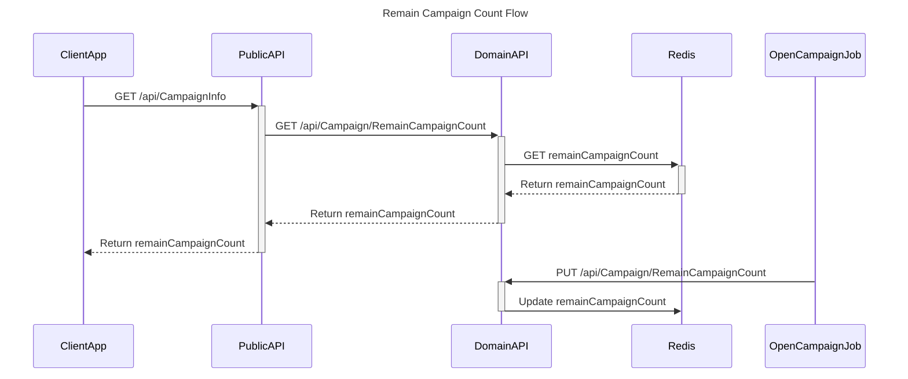

```mermaid
---
title: Remain Campaign Count Flow
---
sequenceDiagram
    ClientApp->>+PublicAPI: GET /api/CampaignInfo
    PublicAPI->>+DomainAPI: GET /api/Campaign/RemainCampaignCount
    DomainAPI->>+Redis: GET remainCampaignCount
    Redis-->>-DomainAPI: Return remainCampaignCount
    DomainAPI-->>-PublicAPI: Return remainCampaignCount 
    PublicAPI-->>-ClientApp: Return remainCampaignCount 
    OpenCampaignJob->>+DomainAPI: PUT /api/Campaign/RemainCampaignCount
    DomainAPI->>-Redis: Update remainCampaignCount
```
